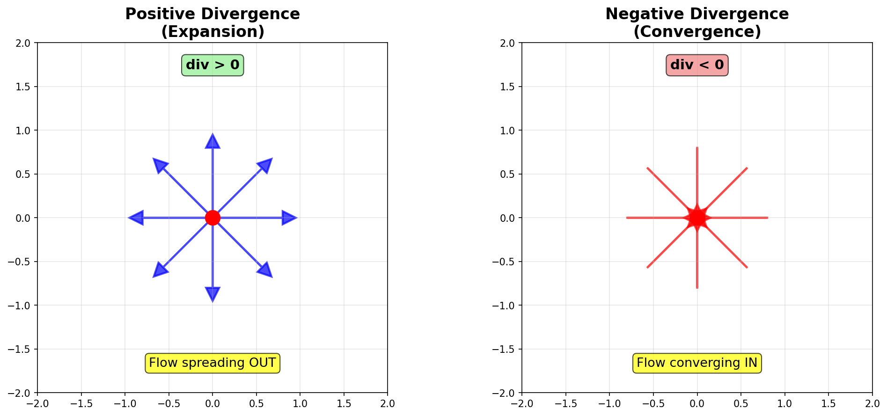
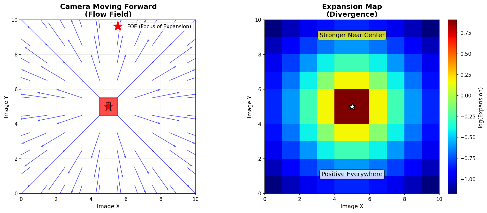
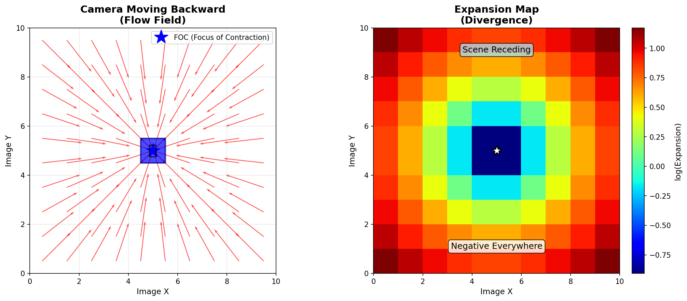
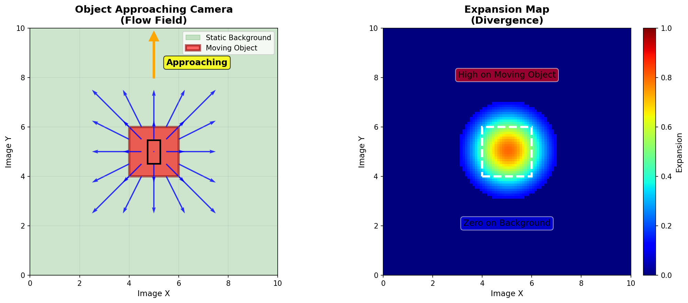
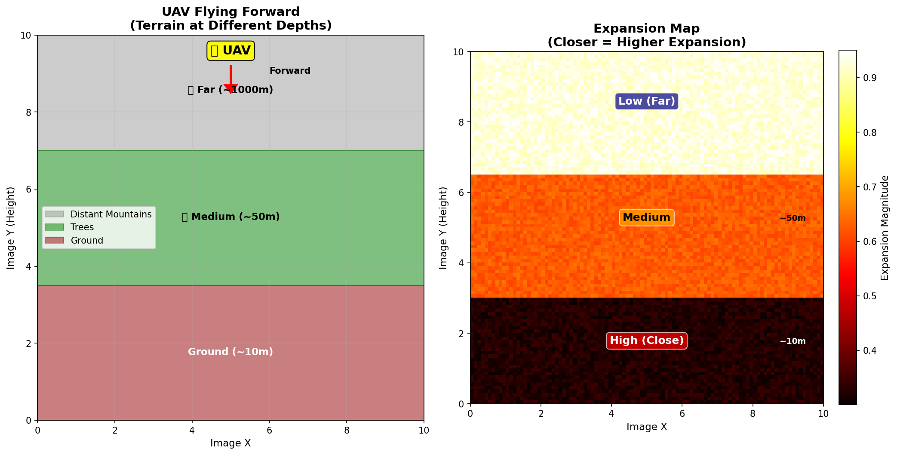
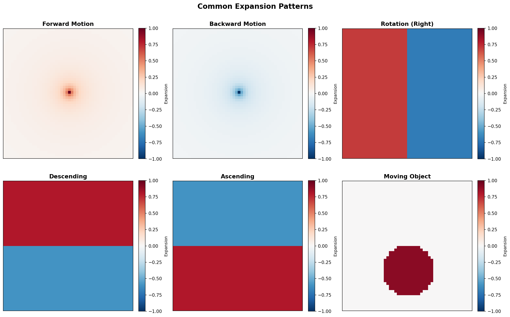
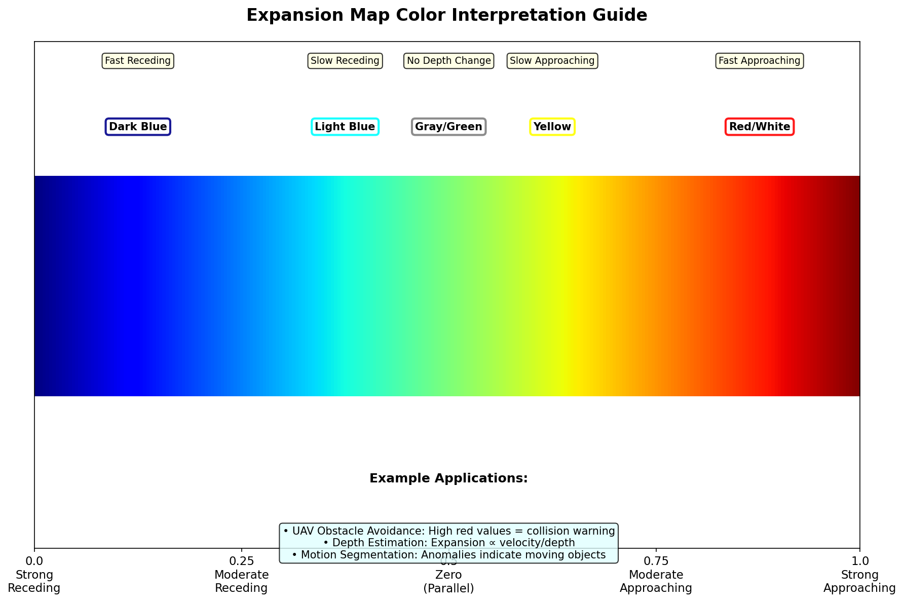

# Optical Expansion Documentation

Comprehensive guide to understanding optical expansion (divergence) in optical flow analysis.

---

## Contents

### Main Documentation
- **[ExpansionExplained.md](ExpansionExplained.md)** - Complete guide with theory, examples, and code

### Visual Diagrams

| Diagram | Description |
|---------|-------------|
|  | **Divergence Concept** - Positive vs negative divergence |
|  | **Camera Forward** - Flow and expansion when moving forward |
|  | **Camera Backward** - Flow and expansion when moving backward |
|  | **Object Approaching** - Localized expansion from moving object |
|  | **UAV Flight** - Expansion over terrain at different depths |
|  | **Common Patterns** - Reference chart of typical scenarios |
|  | **Color Guide** - How to interpret expansion map colors |

---

## Quick Start

### What is Optical Expansion?

**Optical expansion** (divergence) measures how the optical flow field spreads or contracts at each point:

```
Expansion = ∂u/∂x + ∂v/∂y
```

Where `u` and `v` are the horizontal and vertical components of optical flow.

### Physical Meaning

- **Positive expansion** → Objects approaching camera (getting larger)
- **Negative expansion** → Objects receding from camera (getting smaller)
- **Zero expansion** → Objects moving parallel to image plane

### Key Applications

1. **Collision Detection** - Detect approaching obstacles
2. **Depth Estimation** - Estimate relative depth from expansion
3. **Time-to-Contact** - Calculate TTC = -1 / expansion
4. **Motion Segmentation** - Identify moving objects

---

## Code Examples

### Load and Visualize Expansion

```python
import cv2
import numpy as np
import matplotlib.pyplot as plt

# Load expansion map (16-bit PNG)
exp_map = cv2.imread('exp-0001.png', cv2.IMREAD_UNCHANGED)
exp_normalized = exp_map.astype(np.float32) / 65535.0

# Visualize with color map
plt.imshow(exp_normalized, cmap='jet')
plt.colorbar(label='Normalized Expansion')
plt.title('Optical Expansion')
plt.show()
```

### Compute Expansion from Flow

```python
def compute_expansion(flow):
    """
    Compute expansion (divergence) from optical flow.
    
    Args:
        flow: Optical flow array (H, W, 2)
    
    Returns:
        expansion: Divergence map (H, W)
    """
    u = flow[:, :, 0]
    v = flow[:, :, 1]
    
    # Compute derivatives using Sobel
    du_dx = cv2.Sobel(u, cv2.CV_64F, 1, 0, ksize=3) / 8.0
    dv_dy = cv2.Sobel(v, cv2.CV_64F, 0, 1, ksize=3) / 8.0
    
    # Expansion = divergence
    expansion = du_dx + dv_dy
    
    return expansion
```

### Detect Approaching Objects

```python
def detect_collision_risk(expansion_map, threshold=0.7):
    """
    Detect potential collisions from expansion map.
    """
    # Normalize if needed
    if expansion_map.max() > 1:
        expansion_map = expansion_map / 65535.0
    
    # High positive expansion = approaching
    risk_zones = expansion_map > threshold
    
    # Compute overall risk score
    risk_score = np.mean(expansion_map[risk_zones]) if risk_zones.any() else 0
    
    if risk_score > threshold:
        return "COLLISION WARNING", risk_zones
    else:
        return "SAFE", risk_zones

# Example usage
expansion = cv2.imread('exp-0001.png', cv2.IMREAD_UNCHANGED)
status, zones = detect_collision_risk(expansion)
print(f"Status: {status}")

# Visualize risk zones
plt.imshow(zones, cmap='Reds', alpha=0.5)
plt.title('Collision Risk Zones')
plt.show()
```

---

## File Formats

### Input (from OpticalFlowExpansion)

- **Filename pattern**: `exp-XXXX.png`
- **Format**: 16-bit PNG (grayscale)
- **Value range**: 0 - 65535
- **Normalization**: `(log_expansion - min) / (max - min)`

### Converting Back to Linear

```python
# Load normalized expansion
exp_norm = cv2.imread('exp-0001.png', cv2.IMREAD_UNCHANGED).astype(np.float32) / 65535.0

# Reverse log transform (approximate)
# Note: Original sign and scale information is lost in normalization
exp_linear = np.sign(exp_norm - 0.5) * np.exp(np.abs(exp_norm - 0.5))
```

---

## Interpreting Expansion Maps

### Color Scheme (Jet colormap)

| Color | Normalized Value | Meaning |
|-------|-----------------|---------|
| **Dark Blue** | 0.0 - 0.3 | Strong negative expansion (fast receding) |
| **Light Blue** | 0.3 - 0.45 | Moderate negative expansion |
| **Gray/Green** | 0.45 - 0.55 | Near-zero expansion (parallel motion) |
| **Yellow** | 0.55 - 0.7 | Moderate positive expansion |
| **Red/White** | 0.7 - 1.0 | Strong positive expansion (fast approaching) |

### Common Patterns

#### 1. Forward Camera Motion
- **Appearance**: Radial pattern, positive everywhere
- **Center**: Focus of expansion (FOE)
- **Interpretation**: Camera moving into scene

#### 2. Backward Camera Motion
- **Appearance**: Radial pattern, negative everywhere
- **Center**: Focus of contraction (FOC)
- **Interpretation**: Camera moving away from scene

#### 3. Rotating Camera
- **Appearance**: One side positive, other side negative
- **Interpretation**: Camera rotation about vertical axis

#### 4. Descending/Ascending
- **Appearance**: Top negative, bottom positive (descending)
- **Interpretation**: Vertical camera motion

#### 5. Moving Object
- **Appearance**: Localized high expansion on object
- **Background**: Near-zero expansion
- **Interpretation**: Independent object motion

---

## Applications by Domain

### Autonomous Vehicles
- Collision warning system
- Pedestrian detection
- Lane keeping assistance
- Adaptive cruise control

### Drones/UAVs
- Obstacle avoidance
- Terrain following
- Landing assistance
- Dynamic path planning

### Robotics
- Visual servoing
- Manipulation guidance
- Navigation in dynamic environments
- Human-robot interaction

### Video Analysis
- Motion segmentation
- Object tracking
- Scene understanding
- Action recognition

---

## Regenerating Diagrams

To regenerate all diagrams:

```bash
cd /home/bobmaser/github/OpticalFlowExpansion/docs/expansion
conda activate opt-flow
python generate_expansion_diagrams.py
```

This will create:
- `divergence_concept.png`
- `camera_forward_expansion.png`
- `camera_backward_expansion.png`
- `object_approaching.png`
- `uav_flight_expansion.png`
- `expansion_patterns.png`
- `interpretation_guide.png`

---

## Related Documentation

- **[Flow Visualization](../flow_viz/FlowVisualization_Explained.md)** - How to visualize optical flow
- **[Warping](../wrapper/WarpingExplained.md)** - Frame warping using optical flow
- **[Motion-in-Depth](../motion_in_depth/)** - (Coming soon) Depth ratio estimation
- **[Occlusion](../occlusion/)** - (Coming soon) Occlusion detection

---

## Mathematical Background

### Divergence Theorem

For a vector field **F** = (u, v):

```
div(F) = ∇·F = ∂u/∂x + ∂v/∂y
```

### Physical Interpretation

In 3D, a point moves as:
```
x = f·X/Z
y = f·Y/Z
```

Taking time derivatives and computing divergence:
```
div(u, v) ≈ -2f·Ż/Z²
```

Where:
- `Ż` = velocity in depth direction (positive = receding)
- `Z` = depth
- `f` = focal length

**Key insight**: Expansion ∝ velocity/depth²

---

## References

### Papers
- Horn & Schunck (1981) - "Determining Optical Flow"
- Longuet-Higgins & Prazdny (1980) - "The Interpretation of a Moving Retinal Image"
- Koenderink & van Doorn (1987) - "Facts on Optic Flow"

### Books
- Hartley & Zisserman - "Multiple View Geometry in Computer Vision"
- Szeliski - "Computer Vision: Algorithms and Applications"

### Online Resources
- [Middlebury Optical Flow](http://vision.middlebury.edu/flow/)
- [KITTI Vision Benchmark](http://www.cvlibs.net/datasets/kitti/)

---

## Troubleshooting

### Issue: All values are near 0.5 (gray)
**Cause**: Very small expansion values or normalization issue  
**Solution**: Check if scene has actual depth variation

### Issue: Noisy expansion map
**Cause**: Noisy optical flow input  
**Solution**: Use better flow estimation (RAFT, VCN) or apply smoothing

### Issue: Can't distinguish foreground/background
**Cause**: Uniform camera motion dominates  
**Solution**: Subtract global median to highlight anomalies

---

## Contact

**Author:** Bob Maser  
**Date:** November 12, 2024  
**Project:** OpticalFlowExpansion  
**Location:** `/home/bobmaser/github/OpticalFlowExpansion/docs/expansion/`

For questions or improvements, please contact the author.

