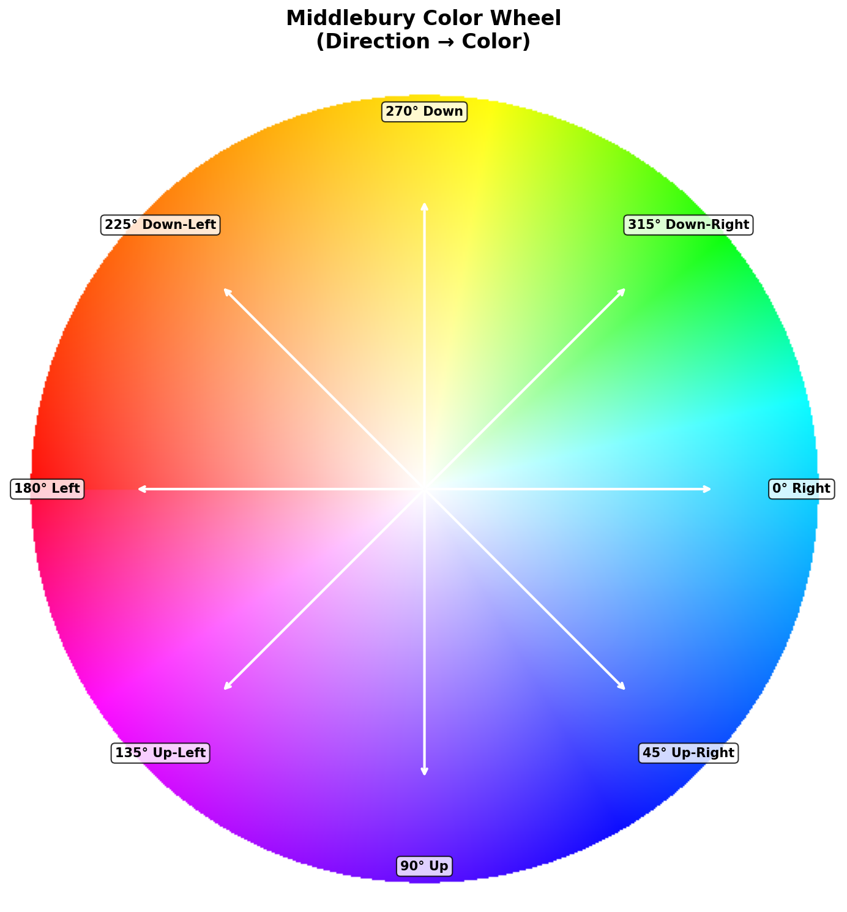
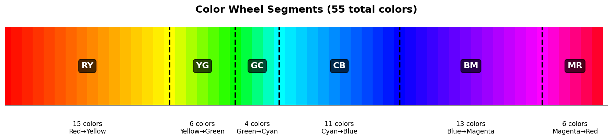
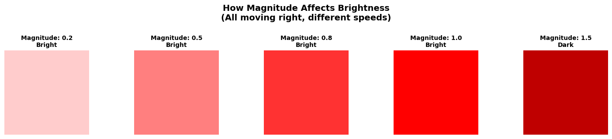
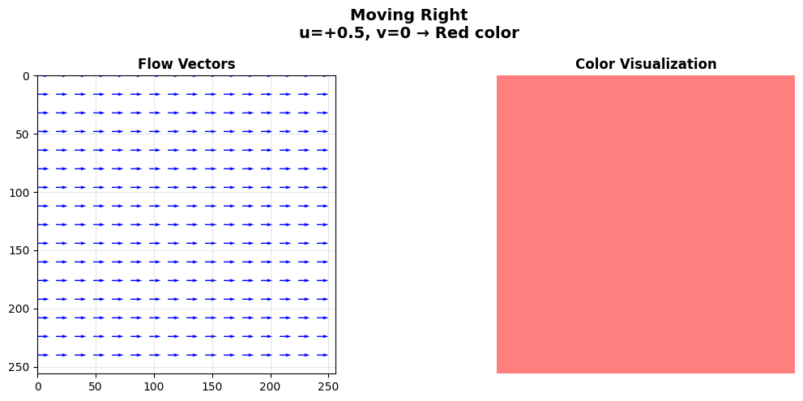
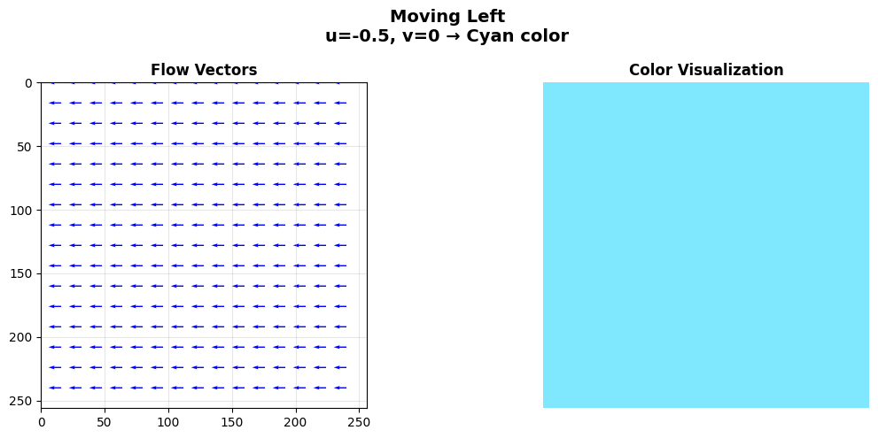
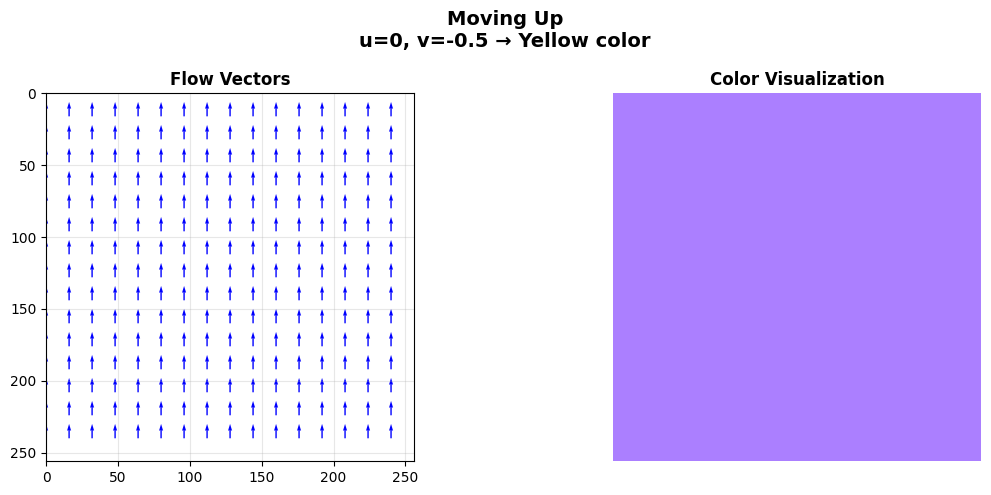
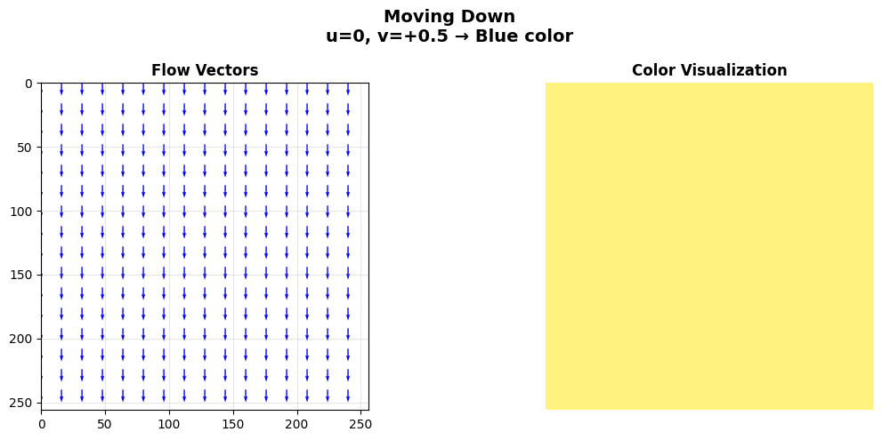
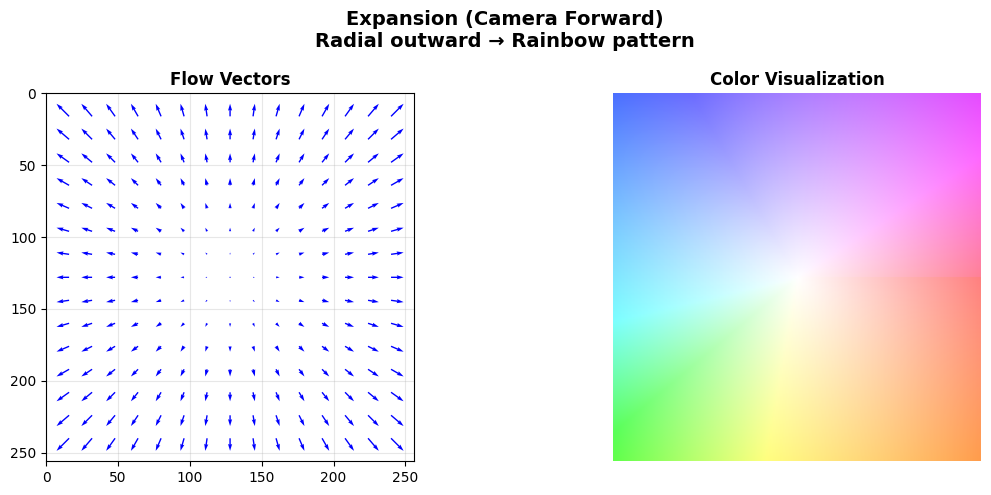
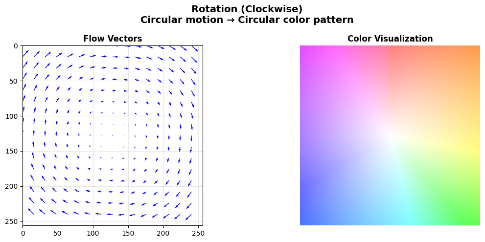

# Documentation - Optical Flow Expansion

This directory contains detailed documentation and visual guides for understanding how optical flow visualization works.

## Main Documents

### 📄 [FlowVisualization_Explained.md](FlowVisualization_Explained.md)
**Complete guide to understanding flow visualization**

A comprehensive, plain-English explanation of how optical flow is converted into colorful visualizations. This document covers:
- What optical flow is and why we visualize it
- The Middlebury color wheel standard
- Step-by-step algorithm breakdown
- Real-world examples and analogies
- Technical formulas for reference

**Perfect for:** Anyone wanting to understand what those colorful flow images actually mean!

---

## Visual Diagrams

All diagrams are automatically generated by `generate_diagrams.py`. To regenerate:

```bash
conda activate opt-flow
cd /home/bobmaser/github/OpticalFlowExpansion
python docs/generate_diagrams.py
```

### Color Wheel Diagram


**File:** `color_wheel.png`

Shows the complete Middlebury color wheel with directional labels. Each color represents a different motion direction:
- **Red** = Right
- **Yellow** = Up
- **Cyan/Green** = Left
- **Blue** = Down

---

### Color Segments


**File:** `color_segments.png`

Breaks down the color wheel into its 6 segments with size annotations:
- **RY** (15 colors): Red → Yellow
- **YG** (6 colors): Yellow → Green
- **GC** (4 colors): Green → Cyan
- **CB** (11 colors): Cyan → Blue
- **BM** (13 colors): Blue → Magenta
- **MR** (6 colors): Magenta → Red

Total: **55 discrete colors**

---

### Magnitude & Brightness


**File:** `magnitude_brightness.png`

Demonstrates how motion speed (magnitude) affects color brightness:
- **Slow motion** (magnitude ≤ 1.0) → Bright colors
- **Fast motion** (magnitude > 1.0) → Darker colors

---

## Example Flow Visualizations

Located in `examples/` directory:

### 1. Right Movement


Uniform rightward motion → Red color

---

### 2. Left Movement


Uniform leftward motion → Cyan color

---

### 3. Upward Movement


Uniform upward motion → Yellow color

---

### 4. Downward Movement


Uniform downward motion → Blue color

---

### 5. Expansion (Camera Forward)


Radial expansion pattern (like camera moving forward) → Rainbow pattern from center

This is what you see when the camera moves toward a scene - everything expands outward from the center (focus of expansion).

---

### 6. Rotation (Clockwise)


Circular rotation pattern → Circular color gradient

---

## Quick Reference

### Color → Direction Mapping

| Color | Direction | u value | v value |
|-------|-----------|---------|---------|
| 🔴 Red | Right | + | 0 |
| 🟡 Yellow | Up | 0 | - |
| 🟢 Cyan/Green | Left | - | 0 |
| 🔵 Blue | Down | 0 | + |
| 🟠 Orange | Up-Right | + | - |
| 🟣 Magenta | Down-Right | + | + |

### Key Formulas

```python
# Direction angle
angle = arctan2(-v, -u) / π

# Motion magnitude
magnitude = sqrt(u² + v²)

# Normalization
u_norm = u / max_magnitude
v_norm = v / max_magnitude
```

---

## Files in This Directory

```
docs/
├── README.md                          # This file
├── FlowVisualization_Explained.md     # Complete guide
├── generate_diagrams.py               # Script to generate all diagrams
├── color_wheel.png                    # Color wheel diagram
├── color_segments.png                 # Segment breakdown
├── magnitude_brightness.png           # Brightness vs magnitude
└── examples/                          # Example visualizations
    ├── right_movement.png
    ├── left_movement.png
    ├── upward_movement.png
    ├── downward_movement.png
    ├── expansion.png
    └── rotation.png
```

---

## Related Files

- **Source Code:** [`utils/flowlib.py`](../utils/flowlib.py)
  - `flow_to_image()` - Main conversion function
  - `compute_color()` - Color mapping algorithm
  - `make_color_wheel()` - Color wheel generation
  - `point_vec()` - Arrow overlay drawing

- **Main Script:** [`submission.py`](../submission.py)
  - Line 156: Calls `flowlib.point_vec()` to create flow visualizations

---

## Understanding Your Results

When you run inference with this project, you get several outputs including:

- **`flo-*.png`**: Raw optical flow data (2 channels: u, v)
- **`visflo-*.jpg`**: 🌈 **Color-coded visualization** (explained in this doc!)
- **`exp-*.png`**: Optical expansion (divergence of flow)
- **`mid-*.png`**: Motion-in-depth (relative depth change)
- **`occ-*.png`**: Occlusion mask (areas becoming hidden/visible)
- **`warp-*.jpg`**: Second frame warped using predicted flow

The `visflo-*.jpg` files are what this documentation explains - they use the Middlebury color wheel to make optical flow easy to understand at a glance!

---

**Created by:** Bob Maser  
**Date:** November 2024  
**Project:** [Optical Flow Expansion](https://github.com/BMaser/OpticalFlowExpansion)

