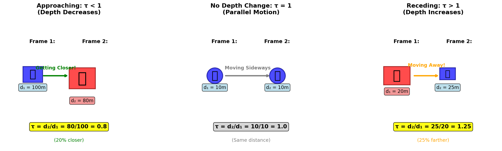
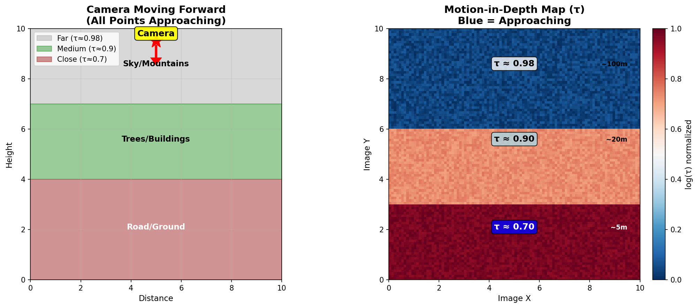
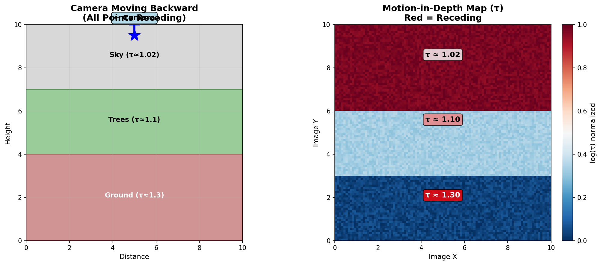
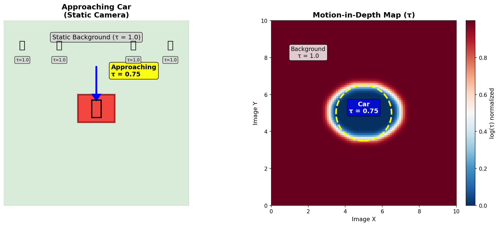
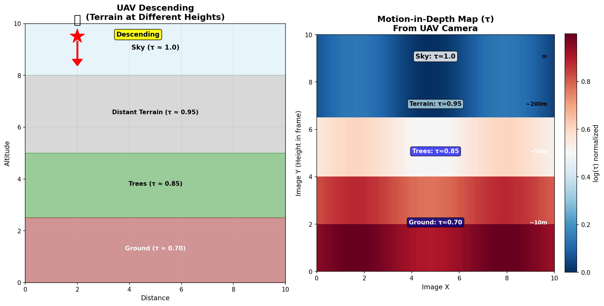
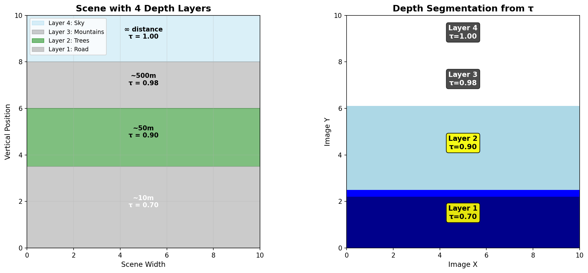
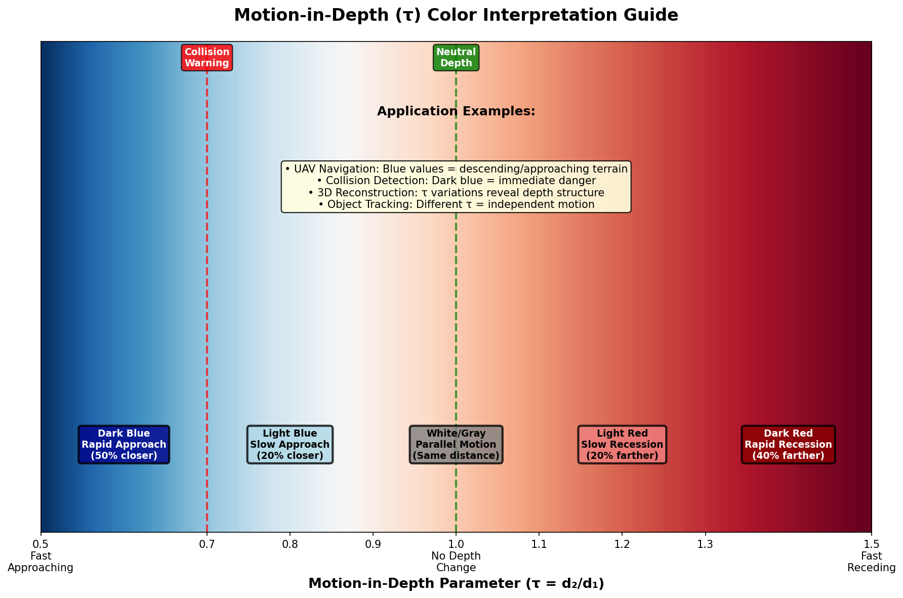

# Motion-in-Depth (MID) Documentation

Comprehensive guide to understanding motion-in-depth (τ = d₂/d₁) in optical flow analysis.

---

## Contents

### Main Documentation
- **[MotionInDepthExplained.md](MotionInDepthExplained.md)** - Complete guide with theory, examples, and code

### Visual Diagrams

| Diagram | Description |
|---------|-------------|
|  | **Tau Concept** - Understanding τ < 1, τ = 1, τ > 1 |
|  | **Camera Forward** - All points approaching (τ < 1) |
|  | **Camera Backward** - All points receding (τ > 1) |
|  | **Object Approaching** - Localized τ < 1 on moving object |
|  | **UAV Descending** - Depth gradient in aerial view |
|  | **Depth Layers** - Segmentation by τ values |
|  | **Color Guide** - How to interpret MID map colors |

---

## Quick Start

### What is Motion-in-Depth?

**Motion-in-Depth (MID)** is the ratio of depths between consecutive frames:

```
τ = d₂/d₁ = Z(t+1) / Z(t)
```

### Physical Meaning

- **τ < 1** → Object APPROACHING (depth decreased)
- **τ = 1** → No motion in depth (parallel motion only)  
- **τ > 1** → Object RECEDING (depth increased)

### Real-World Examples

```
Example 1: Car approaching
  Frame 1: d₁ = 100m
  Frame 2: d₂ = 80m
  τ = 0.8 (20% closer)

Example 2: Person moving sideways
  Frame 1: d₁ = 10m
  Frame 2: d₂ = 10m
  τ = 1.0 (same distance)

Example 3: Cyclist moving away
  Frame 1: d₁ = 20m
  Frame 2: d₂ = 25m
  τ = 1.25 (25% farther)
```

---

## Key Applications

### 1. Monocular 3D Reconstruction

Recover 3D structure from single moving camera:

```python
def reconstruct_depth(tau, camera_translation):
    """
    Estimate depth from motion-in-depth.
    
    For forward motion: τ = (Z + T) / Z
    Solving for Z: Z = T / (1 - τ)
    """
    depth = camera_translation / (1 - tau + 1e-8)
    return np.clip(depth, 0.1, 1000)
```

### 2. Scene Flow Estimation

Combine 2D flow with MID to get full 3D motion:

```
Scene Flow = (u, v, Δz) = (lateral_x, lateral_y, depth_change)
```

### 3. Collision Time Prediction

```python
def estimate_collision_time(tau, dt):
    """
    Time until collision for approaching objects.
    
    TTC = dt / (1 - tau)
    """
    approaching = tau < 1.0
    ttc = np.full_like(tau, np.inf)
    ttc[approaching] = dt / (1 - tau[approaching] + 1e-8)
    return ttc
```

### 4. Depth Segmentation

Segment scene into depth layers based on τ values:

```python
# Objects at different depths have different tau
depth_layers = kmeans(mid_map, n_clusters=4)
```

---

## Code Examples

### Load and Visualize MID

```python
import cv2
import numpy as np
import matplotlib.pyplot as plt

# Load motion-in-depth map (16-bit PNG)
mid_map = cv2.imread('mid-0001.png', cv2.IMREAD_UNCHANGED)
mid_normalized = mid_map.astype(np.float32) / 65535.0

# Visualize with color map
plt.imshow(mid_normalized, cmap='RdBu_r')
plt.colorbar(label='Normalized log(τ)')
plt.title('Motion-in-Depth')
plt.show()
```

### Detect Approaching Objects

```python
def detect_approaching(mid_normalized, threshold=0.45):
    """
    Detect approaching objects (τ < 1).
    
    In normalized log space, approaching objects have
    values below the midpoint (0.5).
    """
    approaching = mid_normalized < threshold
    
    # Clean up with morphology
    kernel = cv2.getStructuringElement(cv2.MORPH_ELLIPSE, (5, 5))
    approaching = cv2.morphologyEx(
        approaching.astype(np.uint8),
        cv2.MORPH_CLOSE,
        kernel
    ).astype(bool)
    
    return approaching

# Example usage
mid_map = cv2.imread('mid-0001.png', cv2.IMREAD_UNCHANGED) / 65535.0
approaching_mask = detect_approaching(mid_map)

plt.imshow(approaching_mask, cmap='Reds', alpha=0.7)
plt.title('Approaching Objects (τ < 1)')
plt.show()
```

### Segment by Depth Motion

```python
def segment_by_depth_motion(mid_map, flow, threshold=0.05):
    """
    Segment independently moving objects using MID.
    """
    # Global median tau (camera motion)
    global_tau = np.median(mid_map)
    
    # Find anomalies
    tau_anomaly = np.abs(mid_map - global_tau)
    
    # Also check flow magnitude
    flow_mag = np.sqrt(flow[:, :, 0]**2 + flow[:, :, 1]**2)
    
    # Moving objects: different tau + significant flow
    moving = (tau_anomaly > threshold) & (flow_mag > 5.0)
    
    return moving
```

### Estimate Depth Order

```python
def estimate_depth_ordering(mid_map, camera_motion='forward'):
    """
    Estimate relative depth from motion-in-depth.
    """
    mid_norm = mid_map / 65535.0  # Normalize if needed
    
    if camera_motion == 'forward':
        # Smaller tau = closer (more relative change)
        depth_order = 1.0 / (mid_norm + 1e-8)
    elif camera_motion == 'backward':
        # Larger tau = closer
        depth_order = mid_norm
    
    # Normalize to [0, 1]
    depth_order = (depth_order - depth_order.min()) / \
                  (depth_order.max() - depth_order.min() + 1e-8)
    
    return depth_order
```

---

## File Formats

### Input (from OpticalFlowExpansion)

- **Filename pattern**: `mid-XXXX.png`
- **Format**: 16-bit PNG (grayscale)
- **Value range**: 0 - 65535
- **Transformation**: log(τ) normalized to [0, 1], then scaled

### Interpretation

```python
# Load normalized MID
mid_norm = cv2.imread('mid-0001.png', cv2.IMREAD_UNCHANGED) / 65535.0

# Approximate tau values
# (Note: Exact reversal requires knowing original min/max)
log_tau_approx = (mid_norm - 0.5) * 4  # Scaling factor estimated
tau_approx = np.exp(log_tau_approx)

# Interpretation:
# mid_norm < 0.45  →  τ < 1  (approaching)
# mid_norm ≈ 0.5   →  τ ≈ 1  (no depth change)
# mid_norm > 0.55  →  τ > 1  (receding)
```

---

## Interpreting MID Maps

### Color Scheme (RdBu_r colormap)

| Color | Normalized Value | τ (approx) | Meaning |
|-------|-----------------|------------|---------|
| **Dark Blue** | 0.0 - 0.3 | < 0.7 | Fast approaching |
| **Light Blue** | 0.3 - 0.45 | 0.7 - 0.95 | Slow approaching |
| **White/Gray** | 0.45 - 0.55 | 0.95 - 1.05 | No depth change |
| **Light Red** | 0.55 - 0.7 | 1.05 - 1.3 | Slow receding |
| **Dark Red** | 0.7 - 1.0 | > 1.3 | Fast receding |

### Common Patterns

#### 1. Forward Camera Motion
- **Appearance**: Uniform blue tones (all τ < 1)
- **Gradient**: Darker near bottom (ground closer)
- **Interpretation**: Camera moving into scene

#### 2. Backward Camera Motion
- **Appearance**: Uniform red tones (all τ > 1)
- **Gradient**: Darker red near bottom
- **Interpretation**: Camera moving away from scene

#### 3. Static Camera, Moving Object
- **Appearance**: Mostly white/gray (τ ≈ 1)
- **Localized blue**: Approaching object
- **Sharp boundaries**: Object edges

#### 4. UAV Descending
- **Appearance**: Vertical gradient
- **Top**: White (sky, τ ≈ 1)
- **Middle**: Light blue (distant terrain)
- **Bottom**: Dark blue (close ground)

#### 5. Depth Layers
- **Appearance**: Horizontal bands
- **Each band**: Different τ value
- **Useful for**: Scene segmentation

---

## Relationship to Other Outputs

### Motion-in-Depth vs Expansion

| Property | Expansion (div) | Motion-in-Depth (τ) |
|----------|----------------|---------------------|
| **Definition** | ∂u/∂x + ∂v/∂y | Z₂ / Z₁ |
| **Type** | Differential (rate) | Integral (ratio) |
| **Units** | 1/time | Dimensionless |
| **Use** | Collision detection | 3D reconstruction |

**Connection:**
```
τ ≈ 1 + (expansion · Z · Δt) / (2f)
```

### Combined with Optical Flow

```
Optical Flow (u, v)  →  2D motion in image plane
Motion-in-Depth (τ)  →  1D motion along depth axis
──────────────────────────────────────────────────
Scene Flow           →  Full 3D motion vector
```

---

## Applications by Domain

### Autonomous Vehicles
- Time-to-collision estimation
- Pedestrian approach detection
- Lane-keeping with depth
- Adaptive cruise control

### Drones/UAVs
- Terrain following (τ gradient)
- Landing guidance (ground τ)
- Obstacle approach warning
- 3D mapping from monocular video

### Robotics
- Monocular depth sensing
- Grasp planning (object depth)
- Navigation in 3D space
- Human-robot interaction

### Video Analysis
- 3D reconstruction from video
- Depth-based segmentation
- Action recognition (3D motion)
- Visual effects (depth compositing)

---

## Regenerating Diagrams

To regenerate all diagrams:

```bash
cd /home/bobmaser/github/OpticalFlowExpansion/docs/motion_in_depth
conda activate opt-flow
python generate_mid_diagrams.py
```

This will create:
- `tau_concept.png`
- `camera_forward_mid.png`
- `camera_backward_mid.png`
- `object_approaching_mid.png`
- `uav_descending_mid.png`
- `depth_layers.png`
- `interpretation_guide.png`

---

## Related Documentation

- **[Optical Expansion](../expansion/ExpansionExplained.md)** - Rate of depth change (div)
- **[Flow Visualization](../flow_viz/FlowVisualization_Explained.md)** - 2D motion visualization
- **[Warping](../wrapper/WarpingExplained.md)** - Frame warping with flow
- **[Occlusion](../occlusion/)** - (Coming soon) Occlusion detection

---

## Mathematical Background

### Projection and Depth

A 3D point projects to image:
```
x = f·X/Z
y = f·Y/Z
```

### Motion-in-Depth Parameter

For a moving point:
```
Z₁ → Z₂
τ = Z₂ / Z₁
```

### From Optical Flow

Optical flow contains depth information:
```
u = f·(Ẋ·Z - X·Ż)/Z²
v = f·(Ẏ·Z - Y·Ż)/Z²
```

Dividing and combining:
```
τ = 1 + (Ż/Z)·Δt
```

### Log Transform

Used for visualization and computation:
```
log(τ) = log(Z₂) - log(Z₁)
```

Properties:
- Symmetric around 0
- Additive across frames
- Numerically stable

---

## Troubleshooting

### Issue: All values near 0.5 (white/gray)
**Cause**: Minimal depth change or parallel motion  
**Solution**: Check if scene has actual depth variation; may be correct for lateral camera motion

### Issue: Noisy MID map
**Cause**: Noisy flow input or incorrect camera motion  
**Solution**: Use better flow estimation (VCN, RAFT) or apply bilateral filtering

### Issue: Cannot distinguish foreground/background
**Cause**: Uniform camera motion affects all depths  
**Solution**: Look for anomalies (different τ) to find independently moving objects

### Issue: Unexpected τ > 1 when approaching
**Cause**: May be measuring camera recession, not object approach  
**Solution**: Consider camera egomotion; object τ < 1 relative to camera motion

---

## References

### Papers
- **VCN**: Yang et al. (2019) - "Volumetric Correspondence Networks"
- **Scene Flow**: Menze & Geiger (2015) - "Object Scene Flow for Autonomous Vehicles"
- **Structure from Motion**: Longuet-Higgins & Prazdny (1980)

### Books
- Hartley & Zisserman - "Multiple View Geometry in Computer Vision"
- Szeliski - "Computer Vision: Algorithms and Applications"
- Ma et al. - "An Invitation to 3-D Vision"

### Datasets
- **KITTI Scene Flow**: Scene flow ground truth
- **FlyingThings3D**: Synthetic scene flow data
- **Sintel**: Optical flow + depth

---

## Quick Reference Card

```python
# Essential MID operations

# 1. Load MID map
mid = cv2.imread('mid-0001.png', cv2.IMREAD_UNCHANGED) / 65535.0

# 2. Find approaching objects
approaching = mid < 0.45

# 3. Find receding objects
receding = mid > 0.55

# 4. Estimate collision time (approximate)
dt = 0.033  # 30 fps
# Convert to tau (rough approximation)
tau_approx = np.exp((mid - 0.5) * 4)
ttc = dt / (1 - tau_approx + 1e-8)
ttc[tau_approx >= 1] = np.inf

# 5. Segment by depth
from sklearn.cluster import KMeans
depth_labels = KMeans(n_clusters=4).fit_predict(mid.reshape(-1, 1))
depth_layers = depth_labels.reshape(mid.shape)

# 6. Visualize
import matplotlib.pyplot as plt
plt.imshow(mid, cmap='RdBu_r')
plt.colorbar(label='τ (normalized)')
plt.title('Motion-in-Depth')
plt.show()
```

---

## Contact

**Author:** Bob Maser  
**Date:** November 12, 2024  
**Project:** OpticalFlowExpansion  
**Location:** `/home/bobmaser/github/OpticalFlowExpansion/docs/motion_in_depth/`

For questions or improvements, please contact the author.

