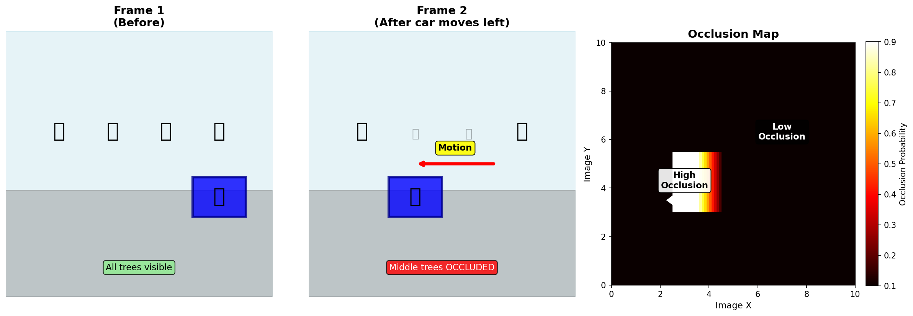
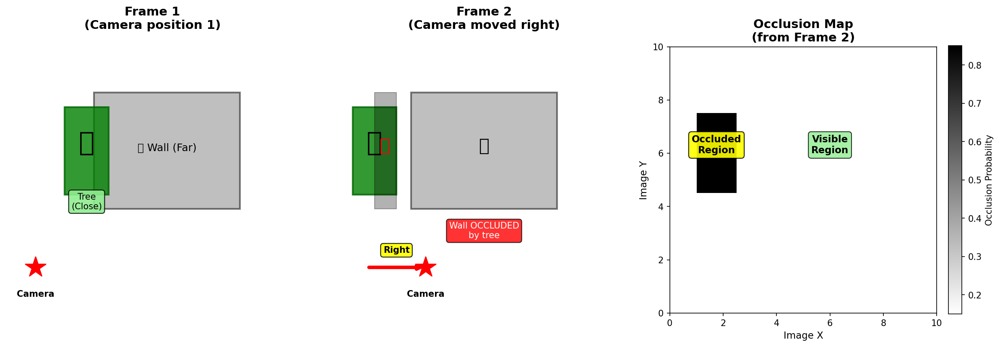
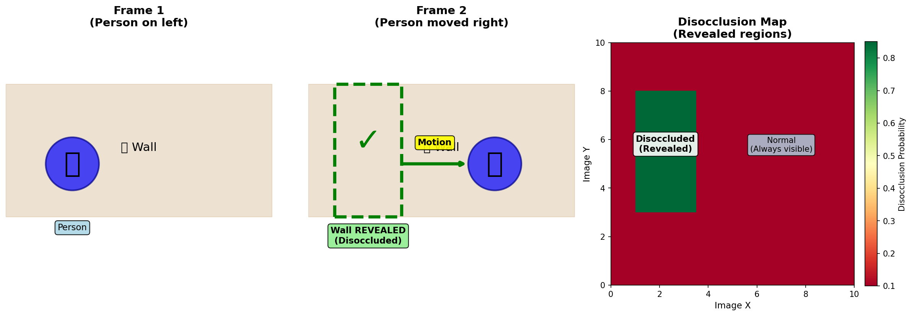
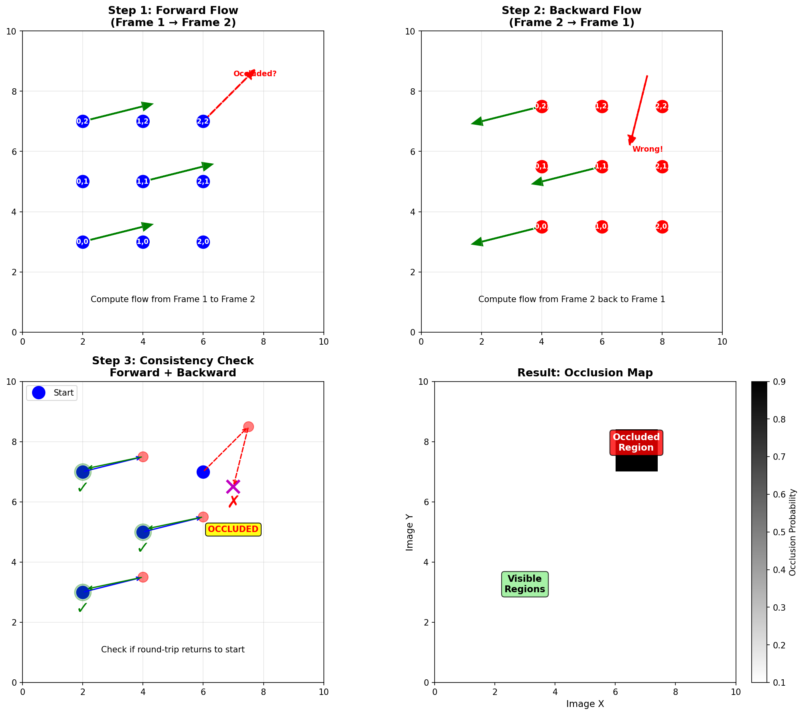
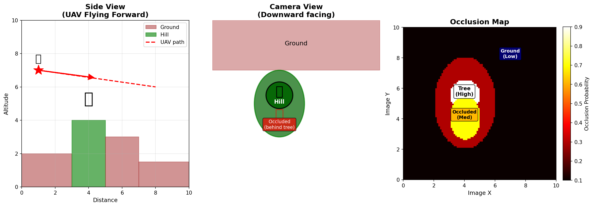

# Occlusion Detection Explained

A comprehensive guide to understanding occlusion and disocclusion detection in optical flow analysis.

**Author:** Bob Maser  
**Date:** November 12, 2024  
**Project:** OpticalFlowExpansion

---

## Table of Contents
1. [What is Occlusion?](#what-is-occlusion)
2. [Why Detect Occlusions?](#why-detect-occlusions)
3. [Types of Occlusions](#types-of-occlusions)
4. [How Occlusions are Detected](#how-occlusions-are-detected)
5. [Visual Examples](#visual-examples)
6. [Practical Applications](#practical-applications)
7. [Interpreting Occlusion Maps](#interpreting-occlusion-maps)
8. [Summary](#summary)

---

## What is Occlusion?

**Occlusion** occurs when a pixel visible in one frame becomes hidden (occluded) in another frame due to motion or depth changes.

### Simple Analogy

Imagine watching a car pass in front of a tree:
- **Frame 1:** You can see both the tree and the car
- **Frame 2:** The car moves in front of the tree
- **Result:** Part of the tree is now **occluded** (hidden) by the car

Or imagine a person walking past a wall:
- **Frame 1:** You see only the wall
- **Frame 2:** The person moves into view
- **Result:** Part of the wall is now **disoccluded** (revealed background)

### Formal Definition

**Occlusion:** A pixel `p` in frame 1 is **occluded** in frame 2 if:
- It's visible in frame 1
- It's hidden behind another object in frame 2
- Its optical flow points to a location that is blocked

**Disocclusion:** A pixel `p` in frame 2 is **disoccluded** if:
- It was hidden in frame 1
- It becomes visible in frame 2
- It corresponds to previously hidden background

### Key Distinction

```
OCCLUDED (Frame 1 → Frame 2):
  "This pixel disappeared (got hidden)"
  
DISOCCLUDED (Frame 1 → Frame 2):
  "This pixel appeared (was revealed)"
```

---

## Why Detect Occlusions?

### 1. **Optical Flow is Undefined at Occlusions**

At occluded pixels:
- No corresponding pixel exists in the next frame
- Optical flow estimation becomes unreliable
- Need to mark these regions as invalid

### 2. **Object Boundaries**

Occlusions occur at object boundaries:
- Foreground objects occlude background
- Sharp occlusion boundaries → object edges
- Useful for segmentation

### 3. **Depth Ordering**

Occlusions reveal depth ordering:
- Occluding object is closer
- Occluded region is farther
- Helps establish depth layers

### 4. **Video Inpainting & Completion**

For video editing:
- Occluded regions need to be filled
- Disoccluded regions show previously hidden content
- Temporal inpainting requires occlusion maps

### 5. **Motion Analysis**

Occlusions indicate:
- Object motion (moving foreground)
- Camera motion (parallax effects)
- Independent motion vs scene motion

### 6. **3D Reconstruction**

For structure from motion:
- Occluded points lack correspondence
- Must be excluded from triangulation
- Improves 3D reconstruction quality

---

## Types of Occlusions

### 1. **Motion Occlusion**

Caused by object motion relative to background:

```
Frame 1:        Frame 2:
┌──────┐        ┌──────┐
│ Tree │        │ Tree │
│      │   →    │ [CAR]│  ← Car occludes tree
│      │        │      │
└──────┘        └──────┘
```

**Characteristics:**
- Foreground object moves
- Background becomes hidden
- Occlusion at object boundaries

### 2. **Depth Occlusion**

Caused by camera motion with depth variation:

```
Camera moves right →

Frame 1:        Frame 2:
┌──┐            ┌──┐
│A │ ┌──┐       │A │┌──┐
│  │ │B │  →    │  ││B │  ← A occludes more of B
└──┘ └──┘       └──┘└──┘
Close  Far      Close Far
```

**Characteristics:**
- Camera moves
- Closer objects shift more
- Reveals/hides background based on motion direction

### 3. **Self-Occlusion**

Caused by object rotation or deformation:

```
Person rotating →

Frame 1:        Frame 2:
   👤              👤
  /|\             \|/
   |               |
  / \             / \
Face visible   Back visible
```

**Characteristics:**
- Object rotates
- One side becomes visible
- Other side becomes hidden

### 4. **Dis occlusion (Revealed Background)**

The opposite of occlusion:

```
Car moves right →

Frame 1:        Frame 2:
┌──────┐        ┌──────┐
│ [CAR]│   →    │      │
│ Tree │        │ Tree │  ← Tree revealed
└──────┘        └──────┘
```

**Characteristics:**
- Background revealed
- Previously hidden pixels become visible
- Often appears at trailing edges

---

## How Occlusions are Detected

### Method 1: Forward-Backward Consistency

The most common and reliable method:

#### Step 1: Compute Forward Flow

Estimate optical flow from frame 1 to frame 2:
```
Flow_forward: (x, y) in Frame1 → (x', y') in Frame2
```

#### Step 2: Compute Backward Flow

Estimate optical flow from frame 2 to frame 1:
```
Flow_backward: (x', y') in Frame2 → (x'', y'') in Frame1
```

#### Step 3: Check Consistency

For a pixel at (x, y) in frame 1:
```
1. Forward flow gives: (x, y) → (x', y')
2. Backward flow gives: (x', y') → (x'', y'')
3. Check if (x'', y'') ≈ (x, y)
```

**If consistent:** Pixel has valid correspondence (not occluded)  
**If inconsistent:** Pixel is likely occluded

#### Mathematical Formulation

```python
# Forward flow
x' = x + u_forward(x, y)
y' = y + v_forward(x, y)

# Backward flow
x'' = x' + u_backward(x', y')
y'' = y' + v_backward(x', y')

# Consistency error
error = sqrt((x - x'')² + (y - y'')²)

# Occlusion detection
is_occluded = (error > threshold)
```

Typical threshold: 1-2 pixels

### Method 2: Range-Flow Constraint

For scenes with depth information:

```python
# Check if a pixel's flow is physically possible
# given its depth and motion

# Expected flow from depth and motion
expected_flow = compute_flow_from_depth(depth, motion)

# Actual flow from estimation
actual_flow = optical_flow_estimation(img1, img2)

# Occlusion if large discrepancy
is_occluded = |actual_flow - expected_flow| > threshold
```

### Method 3: Brightness Constancy Violation

Occluded pixels violate brightness constancy:

```python
# Brightness constancy assumption:
# I1(x, y) = I2(x + u, y + v)

# For occluded pixels, this breaks
error = |I1(x, y) - I2(x + u, y + v)|

# High error indicates occlusion (or other issues)
is_occluded = error > threshold
```

**Note:** This alone is not reliable (can't distinguish occlusion from lighting changes, shadows, etc.)

### Method 4: VCN Learned Occlusion

The VCN model learns to predict occlusions directly:

```python
# Network jointly predicts:
# - Optical flow (u, v)
# - Expansion (div)
# - Motion-in-depth (tau)
# - Occlusion probability

occlusion_prob = VCN_model(img1, img2)
# occlusion_prob ∈ [0, 1]
# 0 = definitely visible
# 1 = definitely occluded
```

**Training:**
- Supervised: Using ground truth occlusion masks
- Self-supervised: Forward-backward consistency as pseudo-label
- Geometric: Using depth and motion constraints

**Advantages:**
- End-to-end learning
- Handles ambiguous cases better
- Considers context (not just local)

---

## Visual Examples

### Example 1: Moving Car (Motion Occlusion)

A car moving left occludes the background:



```
Frame 1:            Frame 2:            Occlusion Map:
┌─────────────┐    ┌─────────────┐    ┌─────────────┐
│ Road │ Tree │    │[CAR]│ Tree  │    │ XXX │      │
│      │      │ → │     │       │    │ XXX │      │
│      │      │    │     │       │    │ XXX │      │
└─────────────┘    └─────────────┘    └─────────────┘
                                      X = Occluded
```

**Analysis:**
- **Occluded region** (X): Road hidden by car
- **Location**: Left side of car (leading edge)
- **Cause**: Car motion left + closer than background

**In occlusion map:**
- High values (bright) at car's leading edge
- Low values (dark) elsewhere

### Example 2: Camera Moving Right (Parallax Occlusion)

Camera moves right, closer objects shift more:



```
Frame 1:            Frame 2:            Occlusion Map:
┌────┐             ┌────┐              ┌────┐
│Tree│  │Wall│     │Tree││Wall│        │    │XX    │
│    │  │    │  →  │    ││    │        │    │XX    │
└────┘  └────┘     └────┘└────┘        └────┘      
Close   Far         Tree shifted more  XX = Occluded
                                       (Wall hidden)
```

**Analysis:**
- **Occluded region**: Wall hidden behind tree
- **Disoccluded region**: Left side of tree (revealed wall)
- **Cause**: Camera motion + depth variation

### Example 3: Person Walking (Disocclusion)

Person walks right, revealing wall:



```
Frame 1:            Frame 2:            Disocclusion Map:
┌─────────────┐    ┌─────────────┐    ┌─────────────┐
│ │🚶│ Wall  │    │      │ Wall│🚶│    │ XX   │     │
│ │  │       │ →  │      │     │  │    │ XX   │     │
└─────────────┘    └─────────────┘    └─────────────┘
                                      XX = Disoccluded
```

**Analysis:**
- **Disoccluded region** (XX): Wall revealed
- **Location**: Left side (where person was)
- **No valid backward flow**: These pixels didn't exist in frame 1

### Example 4: Forward-Backward Consistency

Visualizing the consistency check:



```
Forward Flow:           Backward Flow:          Result:
(x,y) → (x',y')        (x',y') → (x'',y'')     
┌─────────┐            ┌─────────┐             ┌─────────┐
│  •→→→→  │            │  ←←←←•  │             │  ✓ ✓ ✓  │
│  ↓    ↓ │   +        │  ↑    ↑ │   =         │  ✓ X X  │
│  •→→→X  │            │  X←←←•  │             │  X X X  │
└─────────┘            └─────────┘             └─────────┘
                                               ✓ = Consistent
                                               X = Occluded
```

**Why it works:**
- **Consistent pixels**: Round-trip returns to start
- **Occluded pixels**: Forward flow points to different content in frame 2
- **Backward flow**: Cannot trace back to original pixel

### Example 5: UAV Descending (Multiple Occlusions)

Drone descending reveals and hides terrain:



```
Frame 1:                 Frame 2:                Occlusion Map:
 🚁 (High altitude)      🚁 (Lower)              
┌──────────────┐        ┌──────────────┐        ┌──────────────┐
│   Sky        │        │   Sky        │        │              │
│──Mountain────│   →    │──Mountain────│        │              │
│   Trees      │        │   Trees      │        │   XX  XX     │
│   Ground     │        │Ground+detail │        │   XX  XX     │
└──────────────┘        └──────────────┘        └──────────────┘
                                                XX = Occluded
                                                (New terrain visible)
```

**Characteristics:**
- Descending reveals more ground detail
- Some terrain features become occluded by closer objects
- Occlusion pattern depends on terrain structure

---

## Practical Applications

### 1. Video Inpainting

Fill occluded regions with plausible content:

```python
def video_inpainting(frame1, frame2, occlusion_map):
    """
    Fill occluded regions using surrounding context.
    """
    # Identify occluded pixels
    occluded_mask = occlusion_map > 0.5
    
    # For each occluded pixel, inpaint using:
    # - Spatial neighbors
    # - Temporal information from other frames
    # - Learned priors (deep learning)
    
    inpainted = cv2.inpaint(
        frame2,
        occluded_mask.astype(np.uint8),
        inpaintRadius=3,
        flags=cv2.INPAINT_TELEA
    )
    
    return inpainted
```

### 2. Object Segmentation

Segment objects using occlusion boundaries:

```python
def segment_from_occlusion(occlusion_map, flow):
    """
    Segment moving objects using occlusion boundaries.
    """
    # High occlusion at object boundaries
    occlusion_edges = cv2.Canny(
        (occlusion_map * 255).astype(np.uint8),
        threshold1=50,
        threshold2=150
    )
    
    # Combine with flow magnitude
    flow_mag = np.sqrt(flow[:,:,0]**2 + flow[:,:,1]**2)
    
    # Objects have: high flow + occlusion boundaries
    object_mask = (flow_mag > 5.0) & (occlusion_edges > 0)
    
    # Clean up
    kernel = cv2.getStructuringElement(cv2.MORPH_ELLIPSE, (5, 5))
    object_mask = cv2.morphologyEx(
        object_mask.astype(np.uint8),
        cv2.MORPH_CLOSE,
        kernel
    )
    
    return object_mask
```

### 3. Depth Ordering

Determine which objects are in front:

```python
def estimate_depth_order(occlusion_map, flow):
    """
    Occluding regions are closer than occluded regions.
    """
    # Compute occlusion boundaries
    occlusion_grad = np.gradient(occlusion_map)
    boundary_strength = np.sqrt(occlusion_grad[0]**2 + occlusion_grad[1]**2)
    
    # At boundaries:
    # - Side with low occlusion = farther (occluded)
    # - Side with high occlusion = closer (occluding)
    
    # Simple heuristic:
    depth_order = np.zeros_like(occlusion_map)
    depth_order[occlusion_map < 0.3] = 1.0  # Far (gets occluded)
    depth_order[occlusion_map > 0.7] = 0.0  # Close (occludes)
    
    return depth_order
```

### 4. Flow Refinement

Improve flow estimates by handling occlusions:

```python
def refine_flow_with_occlusion(flow, occlusion_map, threshold=0.5):
    """
    Discard or interpolate flow at occluded regions.
    """
    occluded = occlusion_map > threshold
    
    # Option 1: Set flow to zero (invalid)
    flow_refined = flow.copy()
    flow_refined[occluded] = 0
    
    # Option 2: Interpolate from neighbors
    # flow_refined = cv2.inpaint(flow, occluded, ...)
    
    # Option 3: Extrapolate from valid regions
    from scipy.interpolate import griddata
    valid_points = np.argwhere(~occluded)
    valid_flow = flow[~occluded]
    
    if len(valid_points) > 0:
        # Interpolate
        y, x = np.mgrid[0:flow.shape[0], 0:flow.shape[1]]
        flow_refined[:,:,0] = griddata(
            valid_points, valid_flow[:,0], (y, x), method='linear'
        )
        flow_refined[:,:,1] = griddata(
            valid_points, valid_flow[:,1], (y, x), method='linear'
        )
    
    return flow_refined
```

### 5. Motion Boundary Detection

```python
def detect_motion_boundaries(occlusion_map, threshold=0.4):
    """
    Occlusion boundaries often correspond to object edges.
    """
    # Compute gradient magnitude
    gx = cv2.Sobel(occlusion_map, cv2.CV_64F, 1, 0, ksize=3)
    gy = cv2.Sobel(occlusion_map, cv2.CV_64F, 0, 1, ksize=3)
    
    gradient_mag = np.sqrt(gx**2 + gy**2)
    
    # Threshold to get boundaries
    motion_boundaries = gradient_mag > threshold
    
    # Thin boundaries to single pixel width
    motion_boundaries = cv2.ximgproc.thinning(
        motion_boundaries.astype(np.uint8)
    )
    
    return motion_boundaries
```

### 6. Video Stabilization

```python
def stabilization_with_occlusion(frames, flows, occlusions):
    """
    Use occlusion-aware flow for better video stabilization.
    """
    stabilized = []
    
    for i, (frame, flow, occ) in enumerate(zip(frames, flows, occlusions)):
        # Compute global motion from non-occluded regions only
        valid_flow = flow[occ < 0.3]  # Use only visible pixels
        
        # Estimate camera motion (mean flow in valid regions)
        camera_motion = np.median(valid_flow, axis=0)
        
        # Compensate for camera motion
        M = np.float32([[1, 0, -camera_motion[0]], 
                        [0, 1, -camera_motion[1]]])
        stabilized_frame = cv2.warpAffine(
            frame, M, (frame.shape[1], frame.shape[0])
        )
        
        stabilized.append(stabilized_frame)
    
    return stabilized
```

---

## Interpreting Occlusion Maps

### Color Coding

Our project saves occlusion as 8-bit PNG:

```python
# In submission.py
occ_8bit = np.clip(occ * 255, 0, 255).astype(np.uint8)
cv2.imwrite('occ-XXXX.png', occ_8bit)
```

**Value interpretation:**
- **0 (Black)**: Definitely visible / No occlusion
- **128 (Gray)**: Uncertain / Moderate occlusion probability
- **255 (White)**: Definitely occluded / High occlusion probability

### Grayscale Visualization

| Grayscale Value | Probability | Interpretation |
|----------------|-------------|----------------|
| **0-50** (Dark) | 0-0.2 | Visible, valid correspondence |
| **50-100** | 0.2-0.4 | Low occlusion probability |
| **100-150** | 0.4-0.6 | Moderate uncertainty |
| **150-200** | 0.6-0.8 | Likely occluded |
| **200-255** (Bright) | 0.8-1.0 | Definitely occluded |

### Common Patterns

```
Pattern 1: Moving Object
╔════════════════╗
║ ░░░░░░░░░░░░░░ ║  ░ = Low occlusion (background)
║ ░░░███░░░░░░░░ ║  █ = High occlusion (object edges)
║ ░░░███░░░░░░░░ ║  Object boundaries have high values
║ ░░░░░░░░░░░░░░ ║
╚════════════════╝

Pattern 2: Camera Moving Right
╔════════════════╗
║ ███░░░░░░░░░░░ ║  Left side: occlusion (background hidden)
║ ███░░░░░░░░░░░ ║  Right side: disocclusion (background revealed)
║ ███░░░░░░░░░░░ ║  
║ ███░░░░░░░░░░░ ║
╚════════════════╝

Pattern 3: Forward Camera Motion (No Occlusion)
╔════════════════╗
║ ░░░░░░░░░░░░░░ ║  Mostly low values
║ ░░░░░░░░░░░░░░ ║  All pixels visible in both frames
║ ░░░░░░░░░░░░░░ ║  (Radial expansion, but no hiding)
║ ░░░░░░░░░░░░░░ ║
╚════════════════╝
```

### Reading Occlusion Maps

**For Moving Objects:**
- **High values** at object leading edges (where it covers background)
- **Low values** at trailing edges (where background is revealed)
- **Sharp boundaries** indicate distinct foreground/background

**For Camera Motion:**
- **Lateral motion**: Occlusions on one side, disocclusions on other
- **Forward motion**: Minimal occlusion (everything approaching)
- **Backward motion**: Minimal occlusion (everything receding)

**For UAV/Drone:**
- **Descending**: New terrain revealed (disocclusions)
- **Ascending**: Terrain hidden (occlusions)
- **Forward flight**: Occlusions at terrain discontinuities

---

## Relationship to Other Outputs

### Occlusion vs Motion-in-Depth

Strong relationship:

| τ Value | Motion | Typical Occlusion |
|---------|--------|-------------------|
| τ < 1 | Approaching | **Creates** occlusions (hides background) |
| τ = 1 | Parallel | Minimal occlusions |
| τ > 1 | Receding | **Creates** disocclusions (reveals background) |

**Why?**
- Approaching objects (τ < 1) → Cover more of background → Occlusion
- Receding objects (τ > 1) → Reveal more background → Disocclusion

### Occlusion vs Expansion

Related but distinct:

- **High positive expansion** (approaching) → Likely occlusions
- **High negative expansion** (receding) → Likely disocclusions
- **Uniform expansion** (camera motion) → Fewer occlusions

### Occlusion vs Optical Flow

- **Occluded pixels**: Optical flow is undefined or unreliable
- **Disoccluded pixels**: No corresponding pixel in previous frame
- **Valid pixels**: Flow shows true motion

**Usage:**
```python
# Filter flow using occlusion
valid_flow = flow.copy()
valid_flow[occlusion > 0.5] = np.nan  # Mark invalid
```

### Occlusion vs Warping

- **Warping errors** are high at occlusions
- **Occlusion maps** explain why warping fails
- **Combined usage**: Inpaint occluded regions in warped image

---

## Implementation Details (VCN Model)

### Architecture

The VCN model includes an occlusion prediction head:

```
Input: Image pair (I₁, I₂)
   ↓
Feature Extraction
   ↓
Cost Volume
   ↓
Decoder
   ↓
├── Flow (u, v)
├── Expansion (div)
├── Motion-in-Depth (τ)
└── Occlusion (occ)  ← Our focus
```

### Training

The occlusion head is trained using:

1. **Forward-backward consistency** (self-supervised):
```python
# Compute consistency error
error = ||flow_forward + flow_backward||
occ_pseudo_label = (error > threshold)

# Loss
loss_occ = BCE(occ_pred, occ_pseudo_label)
```

2. **Photometric error** (self-supervised):
```python
# High warping error indicates occlusion
warp_error = |I1 - warp(I2, flow)|
occ_pseudo_label = (warp_error > threshold)
```

3. **Ground truth** (supervised, if available):
```python
# Use ground truth occlusion masks
loss_occ = BCE(occ_pred, occ_gt)
```

### Output Format

```python
# From submission.py

# Occlusion is output as probability [0, 1]
occ = model.predict_occlusion(img1, img2)

# Save as 8-bit PNG
occ_8bit = np.clip(occ * 255, 0, 255).astype(np.uint8)
cv2.imwrite('occ-%s.png' % filename, occ_8bit)
```

---

## Summary

### Key Takeaways

1. **Definition**: Occlusion = pixels hidden/revealed between frames

2. **Types**:
   - **Occluded**: Visible → Hidden
   - **Disoccluded**: Hidden → Visible
   - Caused by motion, depth, or rotation

3. **Detection Methods**:
   - Forward-backward consistency (most reliable)
   - Range-flow constraints
   - Brightness constancy violation
   - Deep learning (VCN)

4. **Applications**:
   - Video inpainting
   - Object segmentation
   - Depth ordering
   - Flow refinement
   - Motion boundary detection

5. **Interpretation**:
   - Bright = Occluded (0.8-1.0 probability)
   - Dark = Visible (0.0-0.2 probability)
   - Occurs at object boundaries

### Related Concepts

- **Motion-in-Depth**: τ < 1 creates occlusions, τ > 1 creates disocclusions
- **Expansion**: High expansion correlates with occlusions
- **Optical Flow**: Invalid at occluded pixels
- **Warping**: Fails at occlusions

### Further Reading

- **Papers**:
  - Backward-Forward Consistency (Alvarez et al., 2007)
  - VCN (Yang et al., 2019)
  - FlowNet2 (Ilg et al., 2017) - Occlusion reasoning
  
- **Books**:
  - Szeliski - "Computer Vision: Algorithms and Applications"
  - Fleet & Weiss - "Optical Flow Estimation" (survey chapter)

---

## Quick Reference

### Python Code Template

```python
import cv2
import numpy as np

# 1. Load occlusion map
occ_map = cv2.imread('occ-0001.png', cv2.IMREAD_GRAYSCALE)
occ_prob = occ_map.astype(np.float32) / 255.0

# 2. Detect occluded regions
occluded_mask = occ_prob > 0.5

# 3. Detect occlusion boundaries
edges = cv2.Canny(occ_map, 50, 150)

# 4. Segment objects using occlusions
flow = ...  # Load optical flow
flow_mag = np.sqrt(flow[:,:,0]**2 + flow[:,:,1]**2)
objects = (flow_mag > 5.0) & (occ_prob > 0.4)

# 5. Refine flow (mark occluded as invalid)
flow_refined = flow.copy()
flow_refined[occluded_mask] = np.nan

# 6. Visualize
import matplotlib.pyplot as plt
plt.imshow(occ_prob, cmap='gray')
plt.colorbar(label='Occlusion Probability')
plt.title('Occlusion Map')
plt.show()
```

### MATLAB Code Template

```matlab
% 1. Load occlusion map
occ_map = imread('occ-0001.png');
occ_prob = double(occ_map) / 255.0;

% 2. Detect occluded regions
occluded_mask = occ_prob > 0.5;

% 3. Find boundaries
boundaries = edge(occ_map, 'Canny');

% 4. Visualize
figure;
imshow(occ_prob);
colormap(gray);
colorbar;
title('Occlusion Probability');

figure;
imshow(occluded_mask);
title('Occluded Regions');

figure;
imshow(boundaries);
title('Occlusion Boundaries');
```

---

**Document Version:** 1.0  
**Last Updated:** November 12, 2024  
**Author:** Bob Maser  
**Project:** OpticalFlowExpansion  
**Location:** `/home/bobmaser/github/OpticalFlowExpansion/docs/occlusion/`

