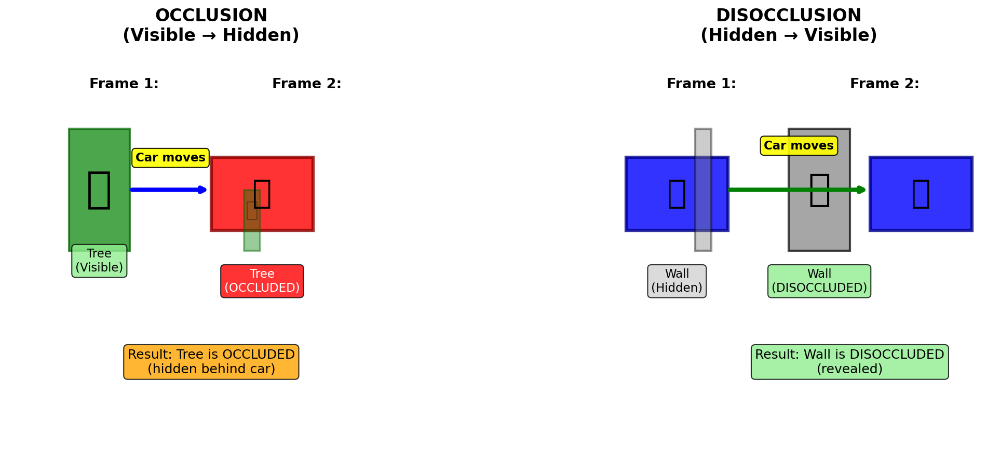
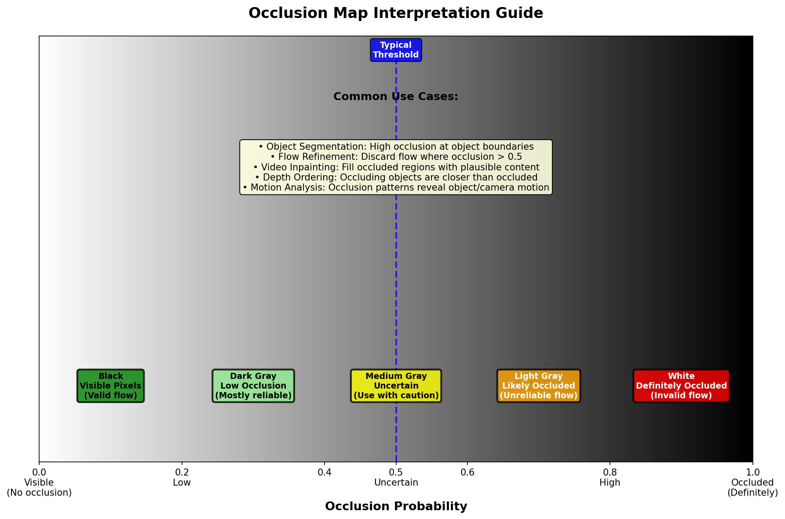

# Occlusion Detection Documentation

Comprehensive guide to understanding occlusion and disocclusion detection in optical flow analysis.

---

## Contents

### Main Documentation
- **[OcclusionExplained.md](OcclusionExplained.md)** - Complete guide with theory, examples, and code

### Visual Diagrams

| Diagram | Description |
|---------|-------------|
|  | **Occlusion Concept** - Occluded vs disoccluded regions |
|  | **Forward-Backward Consistency** - Detection method |
|  | **Car Motion** - Object occluding background |
|  | **Camera Motion** - Parallax occlusion |
|  | **Person Walking** - Disocclusion (revealing background) |
|  | **UAV Flight** - Terrain occlusion patterns |
|  | **Color Guide** - How to interpret occlusion maps |

---

## Quick Start

### What is Occlusion?

**Occlusion** occurs when a pixel visible in one frame becomes hidden in another frame:

- **Occluded**: Visible → Hidden (pixel disappears)
- **Disoccluded**: Hidden → Visible (pixel appears)

### Types of Occlusions

```
1. Motion Occlusion     → Moving object covers background
2. Depth Occlusion      → Camera motion + depth variation
3. Self-Occlusion       → Object rotation/deformation
4. Disocclusion         → Background revealed
```

### Detection Method: Forward-Backward Consistency

```
Step 1: Forward flow:  Frame1 → Frame2
Step 2: Backward flow: Frame2 → Frame1
Step 3: Check if round-trip returns to start

If consistent  → Valid correspondence (not occluded)
If inconsistent → Likely occluded
```

---

## Code Examples

### Load and Visualize Occlusion Map

```python
import cv2
import numpy as np
import matplotlib.pyplot as plt

# Load occlusion map (8-bit PNG)
occ_map = cv2.imread('occ-0001.png', cv2.IMREAD_GRAYSCALE)
occ_prob = occ_map.astype(np.float32) / 255.0

# Visualize
plt.imshow(occ_prob, cmap='gray_r')
plt.colorbar(label='Occlusion Probability')
plt.title('Occlusion Map')
plt.show()
```

### Detect Occluded Regions

```python
def detect_occluded(occ_prob, threshold=0.5):
    """
    Detect occluded pixels.
    
    Args:
        occ_prob: Occlusion probability map [0, 1]
        threshold: Threshold for occlusion (default 0.5)
        
    Returns:
        occluded_mask: Boolean mask of occluded pixels
    """
    occluded_mask = occ_prob > threshold
    
    # Clean up with morphology
    kernel = cv2.getStructuringElement(cv2.MORPH_ELLIPSE, (3, 3))
    occluded_mask = cv2.morphologyEx(
        occluded_mask.astype(np.uint8),
        cv2.MORPH_CLOSE,
        kernel
    ).astype(bool)
    
    return occluded_mask

# Example usage
occ_map = cv2.imread('occ-0001.png', cv2.IMREAD_GRAYSCALE) / 255.0
occluded = detect_occluded(occ_map)

plt.imshow(occluded, cmap='Reds', alpha=0.7)
plt.title('Occluded Regions')
plt.show()
```

### Segment Objects Using Occlusions

```python
def segment_from_occlusion(occ_map, flow, occ_threshold=0.4, flow_threshold=5.0):
    """
    Segment moving objects using occlusion boundaries.
    
    Moving objects have:
    - High occlusion at boundaries
    - Significant optical flow
    """
    # Compute flow magnitude
    flow_mag = np.sqrt(flow[:,:,0]**2 + flow[:,:,1]**2)
    
    # Detect occlusion edges
    edges = cv2.Canny(
        (occ_map * 255).astype(np.uint8),
        threshold1=50,
        threshold2=150
    )
    
    # Combine occlusion and flow
    object_mask = (flow_mag > flow_threshold) & (occ_map > occ_threshold)
    
    # Or use edges
    object_mask_alt = (flow_mag > flow_threshold) & (edges > 0)
    
    return object_mask, object_mask_alt

# Example
occ = cv2.imread('occ-0001.png', cv2.IMREAD_GRAYSCALE) / 255.0
flow = ...  # Load optical flow
objects, objects_alt = segment_from_occlusion(occ, flow)

plt.imshow(objects, cmap='jet', alpha=0.6)
plt.title('Segmented Objects')
plt.show()
```

### Refine Flow with Occlusion

```python
def refine_flow(flow, occ_map, threshold=0.5):
    """
    Mark flow as invalid at occluded regions.
    """
    occluded = occ_map > threshold
    
    # Option 1: Set to NaN
    flow_refined = flow.copy().astype(np.float32)
    flow_refined[occluded] = np.nan
    
    # Option 2: Set to zero
    # flow_refined[occluded] = 0
    
    # Option 3: Interpolate from neighbors
    # (more sophisticated, fills holes)
    
    return flow_refined

# Example
occ = cv2.imread('occ-0001.png', cv2.IMREAD_GRAYSCALE) / 255.0
flow = ...  # Load optical flow
flow_clean = refine_flow(flow, occ)

# Compute statistics on valid flow only
valid_flow = flow_clean[~np.isnan(flow_clean).any(axis=2)]
print(f"Mean flow magnitude: {np.linalg.norm(valid_flow, axis=1).mean():.2f}")
```

### Video Inpainting

```python
def inpaint_occluded(frame, occ_map, threshold=0.5):
    """
    Fill occluded regions using inpainting.
    """
    occluded_mask = (occ_map > threshold).astype(np.uint8)
    
    # Use OpenCV inpainting
    inpainted = cv2.inpaint(
        frame,
        occluded_mask,
        inpaintRadius=3,
        flags=cv2.INPAINT_TELEA  # or cv2.INPAINT_NS
    )
    
    return inpainted

# Example
frame = cv2.imread('frame_0002.jpg')
occ = cv2.imread('occ-0001.png', cv2.IMREAD_GRAYSCALE) / 255.0
result = inpaint_occluded(frame, occ)

cv2.imshow('Original', frame)
cv2.imshow('Inpainted', result)
cv2.waitKey(0)
```

### Compute Forward-Backward Consistency

```python
def compute_fb_consistency(flow_forward, flow_backward):
    """
    Compute forward-backward consistency to detect occlusions.
    
    Args:
        flow_forward: Forward optical flow (H, W, 2)
        flow_backward: Backward optical flow (H, W, 2)
        
    Returns:
        occlusion_map: Occlusion probability (H, W)
    """
    h, w = flow_forward.shape[:2]
    
    # Create coordinate grids
    y, x = np.mgrid[0:h, 0:w].astype(np.float32)
    
    # Forward warp
    x_forward = x + flow_forward[:,:,0]
    y_forward = y + flow_forward[:,:,1]
    
    # Sample backward flow at forward positions
    # (requires interpolation)
    from scipy.interpolate import griddata
    
    points_forward = np.column_stack([y_forward.ravel(), x_forward.ravel()])
    points_original = np.column_stack([y.ravel(), x.ravel()])
    
    # Backward flow at forward positions
    u_back = griddata(points_original, flow_backward[:,:,0].ravel(), 
                      points_forward, method='linear', fill_value=0)
    v_back = griddata(points_original, flow_backward[:,:,1].ravel(),
                      points_forward, method='linear', fill_value=0)
    
    u_back = u_back.reshape(h, w)
    v_back = v_back.reshape(h, w)
    
    # Check consistency
    x_back = x_forward + u_back
    y_back = y_forward + v_back
    
    # Consistency error
    error = np.sqrt((x - x_back)**2 + (y - y_back)**2)
    
    # Convert to probability (sigmoid-like)
    # error > 1 pixel = likely occluded
    occlusion_prob = 1 / (1 + np.exp(-2 * (error - 1)))
    
    return occlusion_prob

# Example
flow_fwd = ...  # Load forward flow
flow_bwd = ...  # Load backward flow
occ_computed = compute_fb_consistency(flow_fwd, flow_bwd)

plt.imshow(occ_computed, cmap='gray_r')
plt.colorbar(label='Occlusion Probability')
plt.title('Computed Occlusion Map')
plt.show()
```

---

## File Formats

### Input (from OpticalFlowExpansion)

- **Filename pattern**: `occ-XXXX.png`
- **Format**: 8-bit PNG (grayscale)
- **Value range**: 0 - 255
- **Interpretation**: `value / 255 = occlusion probability`

### Value Interpretation

```python
occ_map = cv2.imread('occ-0001.png', cv2.IMREAD_GRAYSCALE)
occ_prob = occ_map.astype(np.float32) / 255.0

# Interpretation:
# occ_prob = 0.0    → Definitely visible (black in grayscale)
# occ_prob = 0.5    → Uncertain (gray)
# occ_prob = 1.0    → Definitely occluded (white in grayscale)
```

---

## Interpreting Occlusion Maps

### Grayscale Visualization

| Value (8-bit) | Probability | Color | Meaning |
|--------------|-------------|-------|---------|
| 0-50 | 0.0-0.2 | **Black** | Visible, valid flow |
| 50-100 | 0.2-0.4 | **Dark Gray** | Low occlusion |
| 100-150 | 0.4-0.6 | **Gray** | Uncertain |
| 150-200 | 0.6-0.8 | **Light Gray** | Likely occluded |
| 200-255 | 0.8-1.0 | **White** | Definitely occluded |

### Common Patterns

#### 1. Moving Object
- **Appearance**: High values at object leading edges
- **Location**: Where object covers background
- **Use**: Object segmentation

#### 2. Camera Lateral Motion
- **Appearance**: High on one side, low on other
- **Left side**: Occlusion (background hidden)
- **Right side**: Disocclusion (background revealed)

#### 3. Forward Camera Motion
- **Appearance**: Low values everywhere
- **Reason**: Everything approaching, minimal hiding
- **Exception**: Depth discontinuities

#### 4. UAV Descending
- **Appearance**: Patches of high occlusion
- **Location**: Behind tall objects (trees, buildings)
- **Use**: Terrain mapping, obstacle detection

---

## Applications by Domain

### Autonomous Vehicles
- Object tracking (handle occlusions)
- Pedestrian detection (visible parts)
- Path planning (avoid occluded areas)
- Video stabilization (use non-occluded flow)

### Drones/UAVs
- Terrain mapping (identify hidden areas)
- Obstacle detection (occluding objects are close)
- Landing guidance (avoid occluded zones)
- Video quality assessment

### Robotics
- Visual servoing (track visible parts)
- Grasp planning (handle partial occlusions)
- Navigation (avoid occluded paths)
- Object manipulation

### Video Analysis
- Object tracking across occlusions
- Video inpainting (fill occluded regions)
- Scene understanding (depth from occlusions)
- Video compression (occluded = less important)

### Video Editing
- Object removal (inpaint occluded regions)
- Video stabilization (occluded flow is unreliable)
- Special effects (separate foreground/background)
- Content-aware editing

---

## Relationship to Other Outputs

### Occlusion vs Motion-in-Depth

| τ Value | Motion | Typical Occlusion Effect |
|---------|--------|-------------------------|
| τ < 1 | Approaching | **Creates** occlusions (covers background) |
| τ = 1 | Parallel | Minimal occlusions |
| τ > 1 | Receding | **Creates** disocclusions (reveals background) |

### Occlusion vs Expansion

- **High positive expansion** (approaching) → Likely creates occlusions
- **High negative expansion** (receding) → Likely creates disocclusions
- **Uniform expansion** → Fewer occlusions (pure camera forward/backward)

### Occlusion vs Optical Flow

- **Occluded pixels**: Flow is undefined or unreliable
- **Valid pixels**: Flow shows true motion
- **Use together**: Filter flow using occlusion mask

```python
valid_flow = flow[occlusion < 0.5]
```

### Occlusion vs Warping

- **High warping error** → Likely occlusion
- **Occlusion map** → Explains warping failures
- **Combined**: Inpaint occluded regions in warped image

---

## Regenerating Diagrams

To regenerate all diagrams:

```bash
cd /home/bobmaser/github/OpticalFlowExpansion/docs/occlusion
conda activate opt-flow
python generate_occlusion_diagrams.py
```

This will create:
- `occlusion_concept.png`
- `forward_backward_consistency.png`
- `car_motion_occlusion.png`
- `camera_motion_occlusion.png`
- `person_disocclusion.png`
- `uav_occlusion.png`
- `interpretation_guide.png`

---

## Related Documentation

- **[Optical Flow](../flow_viz/FlowVisualization_Explained.md)** - 2D motion estimation
- **[Motion-in-Depth](../motion_in_depth/MotionInDepthExplained.md)** - Depth ratio (τ)
- **[Expansion](../expansion/ExpansionExplained.md)** - Divergence field
- **[Warping](../wrapper/WarpingExplained.md)** - Frame warping

---

## Troubleshooting

### Issue: All values near 0.5 (gray)
**Cause**: Uncertain occlusion predictions  
**Solution**: Model may need better training data or scene is ambiguous

### Issue: High occlusion everywhere
**Cause**: Forward-backward flows are inconsistent  
**Solution**: Check flow quality; may need better flow estimation

### Issue: No occlusions detected (all black)
**Cause**: Pure forward/backward camera motion  
**Solution**: This is correct! Forward motion doesn't create occlusions

### Issue: Noisy occlusion map
**Cause**: Noisy optical flow input  
**Solution**: Apply morphological operations or bilateral filtering

---

## References

### Papers
- **Forward-Backward Consistency**: Sundaram et al. (2010)
- **VCN**: Yang et al. (2019) - Joint occlusion prediction
- **FlowNet2**: Ilg et al. (2017) - Occlusion reasoning
- **PWC-Net**: Sun et al. (2018) - Occlusion handling

### Books
- Szeliski - "Computer Vision: Algorithms and Applications"
- Fleet & Weiss - "Optical Flow Estimation" (chapter 6)

### Datasets
- **KITTI**: Scene flow with occlusion ground truth
- **Sintel**: Synthetic data with occlusion masks
- **FlyingThings3D**: Large-scale with occlusions

---

## Quick Reference Card

```python
# Essential occlusion operations

# 1. Load occlusion map
occ = cv2.imread('occ-0001.png', cv2.IMREAD_GRAYSCALE) / 255.0

# 2. Threshold
occluded = occ > 0.5

# 3. Find boundaries
boundaries = cv2.Canny((occ * 255).astype(np.uint8), 50, 150)

# 4. Segment objects
flow_mag = np.sqrt(flow[:,:,0]**2 + flow[:,:,1]**2)
objects = (flow_mag > 5.0) & (occ > 0.4)

# 5. Refine flow
flow[occ > 0.5] = np.nan

# 6. Inpaint
inpainted = cv2.inpaint(frame, (occ > 0.5).astype(np.uint8), 3, cv2.INPAINT_TELEA)

# 7. Visualize
plt.imshow(occ, cmap='gray_r')
plt.colorbar(label='Occlusion Probability')
plt.title('Occlusion Map')
plt.show()
```

---

## Contact

**Author:** Bob Maser  
**Date:** November 12, 2024  
**Project:** OpticalFlowExpansion  
**Location:** `/home/bobmaser/github/OpticalFlowExpansion/docs/occlusion/`

For questions or improvements, please contact the author.

