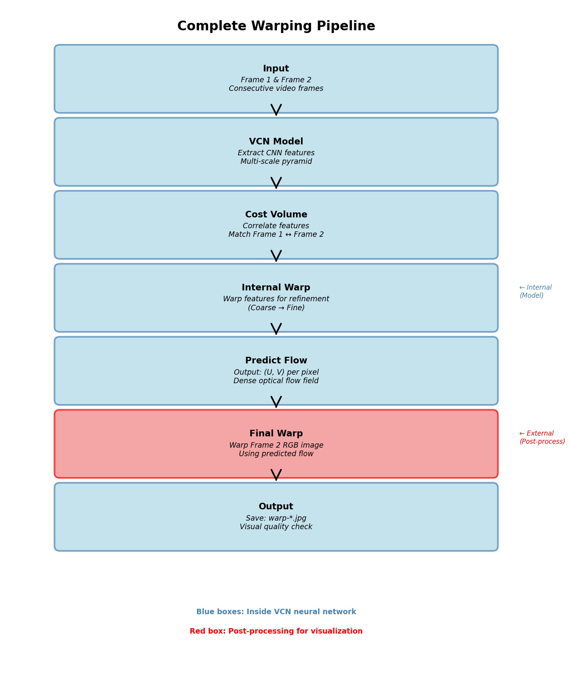
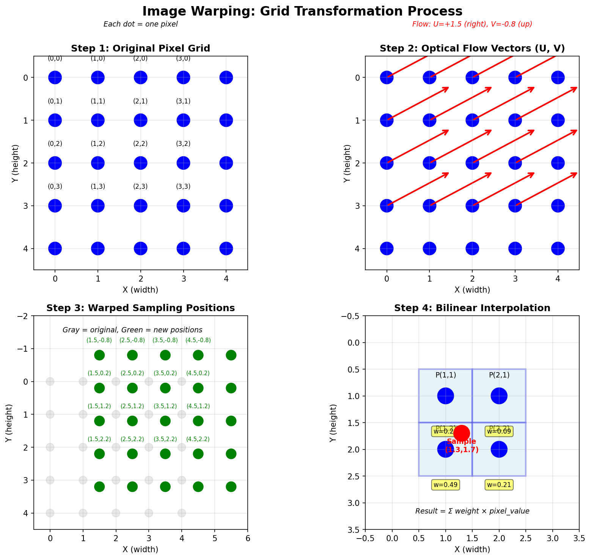
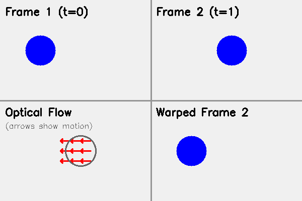
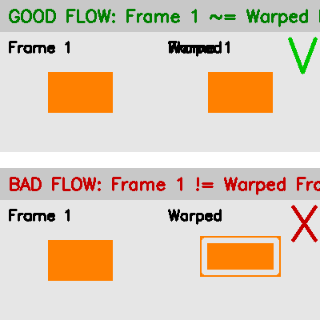

# How Image Warping Works
## A Simple Guide to Understanding Optical Flow Warping

---

## Table of Contents
1. [What is Image Warping?](#what-is-image-warping)
2. [Why Do We Need Warping?](#why-do-we-need-warping)
3. [Complete Pipeline Overview](#complete-pipeline-overview)
4. [Step-by-Step: How the Warper is Created](#step-by-step-how-the-warper-is-created)
5. [Two Types of Warping in This Project](#two-types-of-warping-in-this-project)
6. [Visual Examples](#visual-examples)
7. [Technical Details](#technical-details)

---

## What is Image Warping?

**Image warping** means moving pixels from one position to another to transform an image.

### Simple Analogy:
Imagine you have a photo printed on rubber. If you stretch, bend, or twist the rubber, the image warps. That's what we're doing digitally!

```
Original Frame 2:        Warped Frame 2:
┌──────────┐            ┌──────────┐
│  ●       │            │    ●     │  ← Pixels moved to match Frame 1
│          │     →      │          │
│      ■   │            │     ■    │
└──────────┘            └──────────┘
```

### In This Project:
We use **optical flow** to warp **Frame 2** so it looks like **Frame 1**. This helps us:
- ✅ Verify our flow prediction is correct
- ✅ Detect occlusions (hidden areas)
- ✅ Calculate motion-in-depth
- ✅ Validate frame matching quality

---

## Why Do We Need Warping?

### 1. **Validation**
If our optical flow is accurate, warping Frame 2 using the flow should make it look almost identical to Frame 1!

```
Frame 1 (reference)
    ↓
Optical Flow (U,V vectors)
    ↓
Warp Frame 2 using flow
    ↓
Warped Frame 2 ≈ Frame 1 ✓
```

### 2. **Quality Check**
Compare warped Frame 2 with actual Frame 1:
- **Small differences** = Good flow prediction! 🎉
- **Large differences** = Poor flow or occlusion ⚠️

### 3. **Occlusion Detection**
Some pixels in Frame 1 don't exist in Frame 2 (e.g., hidden behind moving objects). Warping reveals these!

---

## Complete Pipeline Overview

Here's the **entire workflow** from raw frames to warped output:



```
┌─────────────────────────────────────────────────────────────────┐
│                     OPTICAL FLOW WARPING PIPELINE                │
└─────────────────────────────────────────────────────────────────┘

STEP 1: INPUT TWO CONSECUTIVE FRAMES
═══════════════════════════════════════
    Frame 1 (imgL)          Frame 2 (imgR)
    ┌──────────┐            ┌──────────┐
    │  Scene   │            │  Scene   │
    │  at t=0  │            │  at t=1  │
    └──────────┘            └──────────┘
         │                       │
         └───────────┬───────────┘
                     ↓

STEP 2: EXTRACT FEATURES (VCN Model)
═══════════════════════════════════════
         ┌─────────────────┐
         │   PSPNet CNN    │  ← Extract deep features
         │   Encoder       │
         └─────────────────┘
                 ↓
         Feature Maps (multiple scales)
         - Level 6: 1/64 resolution
         - Level 5: 1/32 resolution
         - Level 4: 1/16 resolution
         - Level 3: 1/8 resolution
         - Level 2: 1/4 resolution
                 ↓

STEP 3: COST VOLUME MATCHING (Coarse-to-Fine)
═══════════════════════════════════════════════
    ┌─────────────────────────────────────────┐
    │ For each level (6→5→4→3→2):            │
    │                                          │
    │  1. Correlate features (Frame1↔Frame2)  │
    │  2. Build 4D cost volume                │
    │  3. Predict flow hypotheses              │
    │  4. WARP Frame 2 features to Frame 1    │ ← WARPING INSIDE MODEL!
    │  5. Refine at next level                │
    └─────────────────────────────────────────┘
                 ↓
         Refined Optical Flow
         (u, v) for every pixel
                 ↓

STEP 4: WARP FRAME 2 IMAGE (Final Output)
═══════════════════════════════════════════
    ┌─────────────────────────────────┐
    │  1. Take Frame 2 (original RGB) │
    │  2. Take predicted flow (u, v)  │
    │  3. For each pixel in Frame 2:  │
    │     - Read flow vector (u, v)   │
    │     - Move pixel to new position│
    │  4. Interpolate missing values  │
    └─────────────────────────────────┘
                 ↓
         Warped Frame 2
         (should look like Frame 1)
                 ↓

STEP 5: SAVE OUTPUT FILES
═══════════════════════════
    ├── flo-*.png        (raw flow data)
    ├── visflo-*.jpg     (colorful visualization)
    ├── warp-*.jpg       (← WARPED FRAME 2!)
    ├── occ-*.png        (occlusion mask)
    ├── exp-*.png        (expansion)
    └── mid-*.png        (motion-in-depth)
```

---

## Step-by-Step: How the Warper is Created

### **Part A: Warping Inside the VCN Model** (Training & Refinement)

The model uses **WarpModule** internally to refine flow predictions:

```python
class WarpModule(nn.Module):
    """
    Warp features from Frame 2 to Frame 1 using optical flow
    Used INSIDE the neural network for coarse-to-fine refinement
    """
```

#### How It Works:



```
INPUT:
  - Frame 2 features (from CNN)
  - Coarse optical flow (u, v) from previous level

OUTPUT:
  - Warped Frame 2 features
  - Occlusion mask

PROCESS:
┌──────────────────────────────────────────────────────────┐
│ Step 1: Create Pixel Coordinate Grid                     │
│                                                           │
│   For 4×4 image:                                         │
│   X-coordinates:        Y-coordinates:                   │
│   ┌──────────┐         ┌──────────┐                     │
│   │ 0 1 2 3  │         │ 0 0 0 0  │                     │
│   │ 0 1 2 3  │         │ 1 1 1 1  │                     │
│   │ 0 1 2 3  │         │ 2 2 2 2  │                     │
│   │ 0 1 2 3  │         │ 3 3 3 3  │                     │
│   └──────────┘         └──────────┘                     │
└──────────────────────────────────────────────────────────┘

┌──────────────────────────────────────────────────────────┐
│ Step 2: Add Optical Flow to Grid                         │
│                                                           │
│   Flow (u, v):          New Grid:                        │
│   u = [+1, +1, ...]    X' = X + u                       │
│   v = [-1, -1, ...]    Y' = Y + v                       │
│                                                           │
│   X'-coordinates:       Y'-coordinates:                  │
│   ┌──────────┐         ┌──────────┐                     │
│   │ 1 2 3 4  │         │-1 -1 -1 -1│ (shifted up 1px)   │
│   │ 1 2 3 4  │         │ 0  0  0  0│                     │
│   │ 1 2 3 4  │         │ 1  1  1  1│                     │
│   │ 1 2 3 4  │         │ 2  2  2  2│                     │
│   └──────────┘         └──────────┘                     │
│   (shifted right 1px)                                    │
└──────────────────────────────────────────────────────────┘

┌──────────────────────────────────────────────────────────┐
│ Step 3: Normalize to [-1, +1] for PyTorch               │
│                                                           │
│   PyTorch grid_sample expects coordinates in [-1, 1]:   │
│   - (-1, -1) = top-left corner                          │
│   - (+1, +1) = bottom-right corner                      │
│                                                           │
│   X_normalized = 2 * X' / (W-1) - 1                     │
│   Y_normalized = 2 * Y' / (H-1) - 1                     │
└──────────────────────────────────────────────────────────┘

┌──────────────────────────────────────────────────────────┐
│ Step 4: Sample Frame 2 Features at New Positions         │
│                                                           │
│   Use bilinear interpolation:                            │
│                                                           │
│   Original Feature Map:    Warped Feature Map:           │
│   ┌────┬────┬────┐        ┌────┬────┬────┐             │
│   │ A  │ B  │ C  │        │    │ A  │ B  │  ← shifted  │
│   ├────┼────┼────┤   →    ├────┼────┼────┤             │
│   │ D  │ E  │ F  │        │    │ D  │ E  │             │
│   ├────┼────┼────┤        ├────┼────┼────┤             │
│   │ G  │ H  │ I  │        │    │ G  │ H  │             │
│   └────┴────┴────┘        └────┴────┴────┘             │
└──────────────────────────────────────────────────────────┘

┌──────────────────────────────────────────────────────────┐
│ Step 5: Create Occlusion Mask                            │
│                                                           │
│   Mark pixels that go out of bounds:                     │
│   - If X' < 0 or X' >= Width  → OCCLUDED               │
│   - If Y' < 0 or Y' >= Height → OCCLUDED               │
│                                                           │
│   Mask = 1 (valid), 0 (occluded)                        │
└──────────────────────────────────────────────────────────┘
```

**Code Location:** `models/VCN_exp.py`, lines 87-119

---

### **Part B: Final Image Warping** (Output Visualization)

After the model predicts the final flow, we warp the actual RGB Frame 2 image:

```python
def warp_flow(img, flow):
    """
    Warp Frame 2 (img) using optical flow
    This creates the final warp-*.jpg output file
    """
```

#### Detailed Process:

```
INPUT:
  - img: Frame 2 RGB image (H×W×3)
  - flow: Predicted optical flow (H×W×2)
         flow[:,:,0] = u (horizontal displacement)
         flow[:,:,1] = v (vertical displacement)

┌─────────────────────────────────────────────────────────────┐
│ STEP 1: Create Dense Sampling Grid                          │
│                                                              │
│  For each pixel (x, y) in Frame 2:                         │
│  - Original position: (x, y)                                │
│  - Flow vector: (u, v) = flow[y, x]                        │
│  - New position: (x + u, y + v)                            │
│                                                              │
│  Example:                                                    │
│  Pixel at (100, 50) has flow (u=5, v=-3)                   │
│  → Sample Frame 2 at position (105, 47)                    │
│                                                              │
│  Grid shape: (H, W, 2)                                      │
│    grid[:,:,0] = X + flow[:,:,0]  (x-coordinates)          │
│    grid[:,:,1] = Y + flow[:,:,1]  (y-coordinates)          │
└─────────────────────────────────────────────────────────────┘

┌─────────────────────────────────────────────────────────────┐
│ STEP 2: Sample Using cv2.remap() - Bilinear Interpolation  │
│                                                              │
│  Bilinear interpolation handles non-integer positions:      │
│                                                              │
│  Example: Sample at position (105.3, 47.7)                 │
│                                                              │
│  Neighboring pixels:                                         │
│  ┌────────┬────────┐                                        │
│  │(105,47)│(106,47)│  A=pixel(105,47), B=pixel(106,47)    │
│  │   A    │   B    │  C=pixel(105,48), D=pixel(106,48)    │
│  ├────────┼────────┤                                        │
│  │(105,48)│(106,48)│  dx = 0.3, dy = 0.7                  │
│  │   C    │   D    │                                        │
│  └────────┴────────┘                                        │
│                                                              │
│  Interpolated value:                                         │
│  result = (1-dx)(1-dy)·A + dx(1-dy)·B +                   │
│           (1-dx)dy·C    + dx·dy·D                          │
│                                                              │
│  = 0.7×0.3×A + 0.3×0.3×B + 0.7×0.7×C + 0.3×0.7×D          │
└─────────────────────────────────────────────────────────────┘

┌─────────────────────────────────────────────────────────────┐
│ STEP 3: Handle Out-of-Bounds Pixels                         │
│                                                              │
│  If new position is outside image boundaries:               │
│  - Set to black (0, 0, 0) or white (255, 255, 255)        │
│  - OR copy nearest valid pixel                              │
│                                                              │
│  cv2.remap automatically handles this!                      │
└─────────────────────────────────────────────────────────────┘

OUTPUT:
  Warped Frame 2 (same size as Frame 1)
  Saved as: warp-*.jpg
```

**Code Location:** `utils/flowlib.py`, lines 384-390

---

## Two Types of Warping in This Project

### **Type 1: Feature Warping (Inside Model)**

| Aspect | Details |
|--------|---------|
| **Where** | Inside VCN neural network |
| **When** | During forward pass (training & inference) |
| **What** | Warp CNN features, not RGB images |
| **Purpose** | Refine flow predictions in coarse-to-fine manner |
| **Function** | `WarpModule.forward()` |
| **Method** | PyTorch `grid_sample()` with bilinear interpolation |
| **Output** | Warped feature tensors (internal, not saved) |

**Why?**
- Allows model to iteratively improve flow from coarse to fine
- Level 6 (1/64 res) → Level 5 (1/32) → ... → Level 2 (1/4)
- Each level warps features using previous level's flow

---

### **Type 2: Image Warping (Final Output)**

| Aspect | Details |
|--------|---------|
| **Where** | Post-processing in `submission.py` |
| **When** | After model prediction is complete |
| **What** | Warp actual RGB Frame 2 image |
| **Purpose** | Visualize prediction quality, validate flow |
| **Function** | `warp_flow()` |
| **Method** | OpenCV `cv2.remap()` with bilinear interpolation |
| **Output** | `warp-*.jpg` (saved to disk) |

**Why?**
- Human-readable quality check
- Compare with Frame 1 to see accuracy
- Detect occlusions and errors

---

## Visual Examples



### Example 1: Camera Moving Forward

```
Frame 1 (t=0):              Frame 2 (t=1):
┌─────────────────┐         ┌─────────────────┐
│                 │         │                 │
│      TREE       │         │    T R E E      │  ← Expanded
│       │         │         │      │          │
│       │         │         │      │          │
└─────────────────┘         └─────────────────┘

Optical Flow:
┌─────────────────┐
│  ← ← ← ← → → →  │  ← Tree appears to expand
│  ← ← ← ← → → →  │
│  ← ← ← ← → → →  │
└─────────────────┘

Warp Frame 2 using flow:
┌─────────────────┐
│      TREE       │  ← Should match Frame 1!
│       │         │
│       │         │
└─────────────────┘
```

### Example 2: Object Moving Right

```
Frame 1 (t=0):              Frame 2 (t=1):
┌─────────────────┐         ┌─────────────────┐
│   ●             │         │       ●         │  ← Ball moved right
│                 │         │                 │
└─────────────────┘         └─────────────────┘

Optical Flow:
┌─────────────────┐
│   → → → → →     │  ← Flow vectors point right
│                 │
└─────────────────┘

Warp Frame 2 using flow:
┌─────────────────┐
│   ●             │  ← Ball moved back to Frame 1 position!
│                 │
└─────────────────┘
```

---

## How to Read Warped Outputs



When you run the model, you get these files:

```bash
output/
├── flo-frame001.png      # Raw flow data
├── visflo-frame001.jpg   # Colorful flow visualization
├── warp-frame001.jpg     # ← WARPED FRAME 2
├── occ-frame001.png      # Occlusion mask
├── exp-frame001.png      # Expansion
└── mid-frame001.png      # Motion-in-depth
```

### Quality Check:

**Compare Frame 1 with `warp-frame001.jpg`:**

```
Good Prediction:
Frame 1         warp-frame001.jpg
┌──────┐        ┌──────┐
│ TREE │   ≈    │ TREE │   ← Almost identical! ✓
│  |   │        │  |   │
└──────┘        └──────┘

Poor Prediction:
Frame 1         warp-frame001.jpg
┌──────┐        ┌──────┐
│ TREE │   ≠    │ T│EE │   ← Distorted! ✗
│  |   │        │ R|   │
└──────┘        └──────┘
```

---

## Technical Details

### Bilinear Interpolation Formula

When sampling at non-integer position (x', y'):

```
Let:
  x0 = floor(x'), x1 = x0 + 1
  y0 = floor(y'), y1 = y0 + 1
  dx = x' - x0
  dy = y' - y0

Pixel values:
  I(x0, y0), I(x1, y0), I(x0, y1), I(x1, y1)

Interpolated value:
  I(x', y') = (1-dx)(1-dy)·I(x0,y0) + dx(1-dy)·I(x1,y0) +
              (1-dx)dy·I(x0,y1)     + dx·dy·I(x1,y1)
```

### Coordinate System

```
Image Coordinates:
┌───────────────→ x (width)
│ (0,0)  (1,0)  (2,0)  ...
│ (0,1)  (1,1)  (2,1)  ...
│ (0,2)  (1,2)  (2,2)  ...
↓
y (height)

Flow Convention:
  u = horizontal displacement (Δx)
  v = vertical displacement (Δy)
  
  u > 0 → moving right
  u < 0 → moving left
  v > 0 → moving down
  v < 0 → moving up
```

### Code References

**WarpModule (Neural Network):**
```python
# File: models/VCN_exp.py, lines 87-119
class WarpModule(nn.Module):
    def forward(self, x, flo):
        """
        Warp tensor x using flow flo
        Returns: (warped_output, occlusion_mask)
        """
        vgrid = self.grid + flo
        output = nn.functional.grid_sample(x, vgrid, align_corners=True)
        return output, mask
```

**Image Warping (Post-processing):**
```python
# File: utils/flowlib.py, lines 384-390
def warp_flow(img, flow):
    """
    Warp image using optical flow
    """
    flow_copy = flow.copy().astype(np.float32)
    flow_copy[:,:,0] += np.arange(w)  # Add x-coordinates
    flow_copy[:,:,1] += np.arange(h)[:,np.newaxis]  # Add y-coordinates
    return cv2.remap(img, flow_copy, None, cv2.INTER_LINEAR)
```

**Usage in Main Pipeline:**
```python
# File: submission.py, line 173
imwarped = warp_flow(imgR_o, flow[:,:,:2])
cv2.imwrite(f'{outdir}/warp-{frame_name}.jpg', imwarped)
```

---

## Summary

### The Warping Pipeline:

1. **Input:** Frame 1, Frame 2
2. **VCN Model:** Predicts optical flow (u, v) for every pixel
3. **Internal Warping:** Model warps features during refinement (coarse→fine)
4. **Final Warping:** Warp Frame 2 RGB image using predicted flow
5. **Output:** `warp-*.jpg` showing how well Frame 2 matches Frame 1

### Key Points:

✅ **Two warpings happen:**
   - Inside model: Feature warping for refinement
   - After model: Image warping for visualization

✅ **Purpose:**
   - Validate optical flow accuracy
   - Detect occlusions
   - Visual quality check

✅ **Method:**
   - Bilinear interpolation
   - Coordinate grid transformation
   - Out-of-bounds handling

### Remember:

```
Good Flow → Good Warp → Frame 1 ≈ Warped Frame 2 ✓
Bad Flow  → Bad Warp  → Frame 1 ≠ Warped Frame 2 ✗
```

---

**Created for:** Bob Maser  
**Project:** Optical Flow Expansion  
**Date:** November 2024

For more details, see:
- `models/VCN_exp.py` - WarpModule class
- `utils/flowlib.py` - warp_flow() function
- `submission.py` - Main inference pipeline

